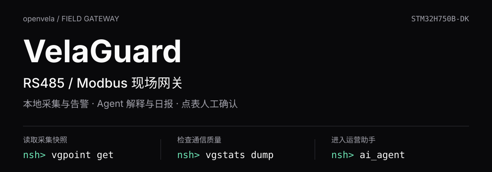
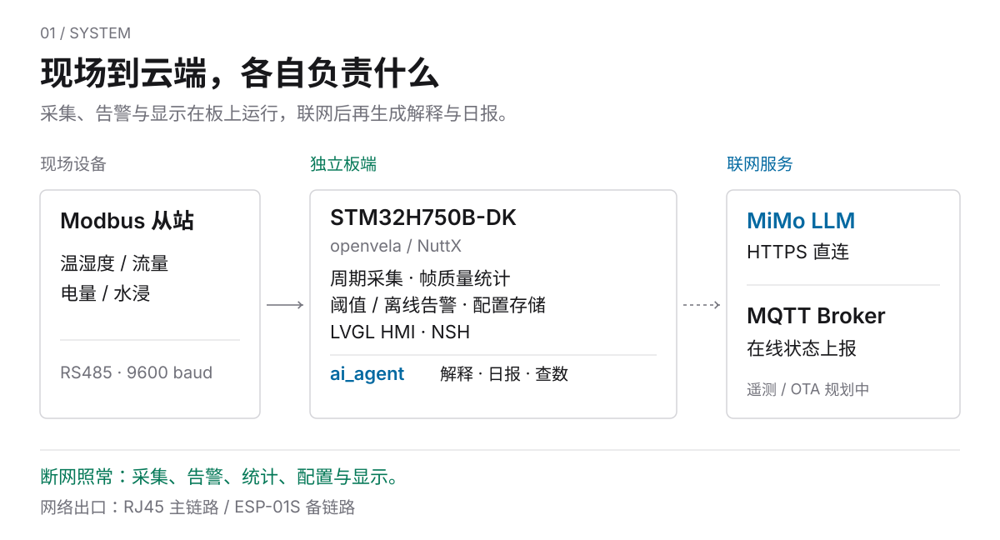
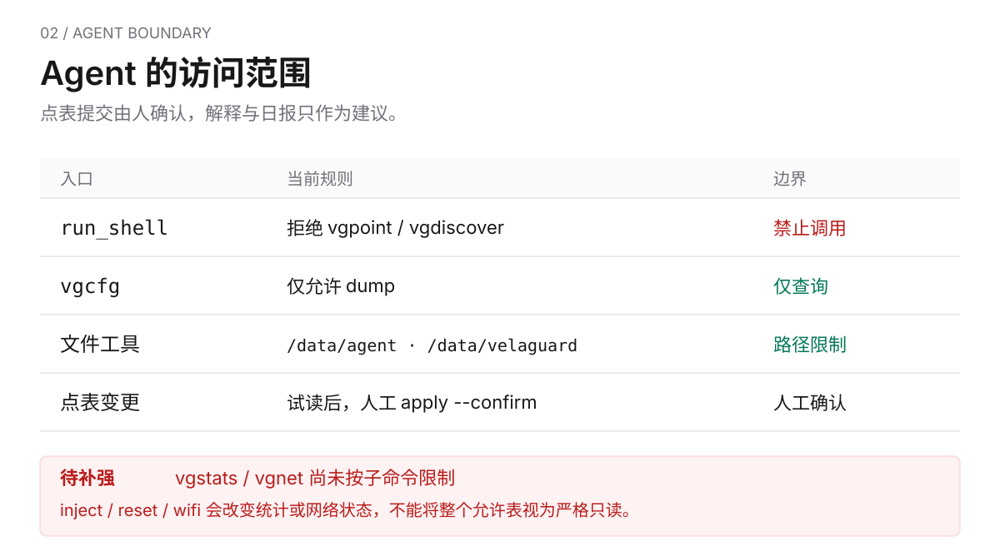

<p align="center">
  <picture>
    <source media="(max-width: 640px)" srcset="./assets/readme/hero-mobile.svg">
    
  </picture>
</p>

<p align="center">
  <b>contest2026_004 · Team Falcons（FoLeaf）</b><br>
  赛道：AI 硬件产品创新 · 硬件：STM32H750B-DK · 系统：openvela / NuttX（<code>dev-ai-contest-2026</code>）
</p>

<p align="center">
  <a href="#评委速览">评委速览</a> ·
  <a href="#主动--执行agent-怎么工作">主动 + 执行</a> ·
  <a href="#功能清单与当前状态">功能清单</a> ·
  <a href="#构建烧录与运行">构建与运行</a> ·
  <a href="#nsh-命令速查">NSH 命令</a> ·
  <a href="VelaGuard_项目手册.md">项目手册</a>
</p>

---

## 这是什么

**VelaGuard** 是一台独立运行在 **STM32H750B-DK + openvela** 上的 **RS485/Modbus 现场网关**。它的核心不是采集转发，而是**把已采集的数据讲给人听**。

采集、告警、帧统计、配置存储全部由板上确定性 C 代码完成，断网照常。板载 `ai_agent` 的用途是告警解释、运行报告和自然语言查数，按只读 Skill 执行。点表提交命令在 C 工具层被拒绝；其他限制的实现范围与待补项见 [Agent 安全边界](#agent-安全边界)。

目标用户是要把设备接到陌生 485 总线上的嵌入式工程师、自动化调试与系统集成人员，不是产线操作工。

---

## 评委速览

| 项 | 内容 |
|----|------|
| 作品名称 | VelaGuard |
| 所属赛道 | AI 硬件产品创新（模式 B：LVGL 应用 + `ai_agent` 框架） |
| 队伍 | contest2026_004 · Team Falcons（GitHub：FoLeaf） |
| 硬件 / 系统 | STM32H750B-DK（Cortex-M7，固件从 QSPI XIP 执行）· openvela / NuttX |
| 交互渠道 | CLI（`vela>` 自然语言查数）+ LVGL 触控 HMI |
| 自定义 Skill | `/data/agent/skills/` 下 `alarm_interpretation.md`、`operations_report.md`、`modbus_query.md`，固件首启自动写入 |
| 主动 + 执行 | **事件主动**：本地告警 → 板端按告警集合发起一轮，Agent 写 `alarm_advice.txt` → 告警页行内建议 + 详情解释；**主动 + 执行**：发现当天还没有日报时板端自己发起一轮，Agent 用只读工具取真实数字写 `daily-<日期>.md` → LVGL 报告页 |
| openvela 能力落点 | 图形（LVGL HMI）+ AI（ai_agent）+ NuttX 串口 / 网络 / 块设备 |
| 运行方式 | [构建、烧录与运行](#构建烧录与运行) · [NSH 命令速查](#nsh-命令速查) · `scripts/stage1_*_accept_nsh.txt` |
| 公共仓改动 | 直接改 nuttx / nuttx-apps / MQTT-C 树并 PR，不用 patch，见 [公共仓改动与 PR](#公共仓改动与-pr) |
| AI Coding 日志 | `logs/Foleaf/`，由官方归集工具生成，见 [AI Coding 日志](#ai-coding-日志) |
| 演示视频 / 作品介绍 | 按大赛要求随作品单独提交 |
| 许可证 | Apache-2.0，原创实现；第三方 nanoMODBUS 保留 MIT |

---

## 它解决什么问题

三个用户故事，对应三条主线：

1. **接入陌生总线**。集成工程师带着网关到现场柜子，不知道总线上有几个从站、什么地址、寄存器怎么解读。打开屏上「启用总线扫描」（默认关），`Scan Bus` 扫地址 1–32，探测寄存器块，生成候选点表，`测试读取` 通过后现场确认，曲线开始跑。全过程本地完成，不需要网络。
2. **夜里温度越限**。规则引擎在板上判定阈值 / 离线告警，屏幕立刻报警，不等网络。联网时板端自己发起一轮，Agent 按 `alarm_interpretation` Skill 调 `vgstats` / `vgmodbus` / `vgcfg` 只读命令，把带证据的解释写进 `reports/alarm_advice.txt`，告警页行内显示一行短建议、详情区显示完整解释并标注「AI 推测」。工程师早上看到的是解释，不是一串原始数值。
3. **本次上电以来的运行概况**。板端发现当天还没有日报时自己发起一轮，Agent 按 `operations_report` Skill 调 `get_current_time` / `vgruntime dump` / `vgstats dump` 取真实数字，写出 `reports/daily-<当天日期>.md`，LVGL 报告页标题显示「AI 日报 · OPENVELACLAW」；随时可以在 `vela>` 用自然语言查当前读数。断网或校验不过时报告页回退固件的 `reports/runtime-report.md` 并标注本地来源。

| 能力 | 常见做法 | VelaGuard | 状态 |
|------|----------|-----------|------|
| 发现从站 | 手工试地址 × 波特率 | `vgdiscover` / HMI 扫描 @9600，地址 1–32 | 已落地（波特率矩阵为阶段 2） |
| 识别数据格式 | 试四种字序看哪个像 | int16 × 0.1 物理合理性筛选生成候选点表 | 基础版已落地；字序 / 倍率联合约束求解为阶段 2 |
| 理解告警 | 看原始数值自己猜 | Agent 自动解释，带 evidence，标「AI 推测」，逐点显示在告警页 | 已落地 |
| 运行概况 | 翻日志 / 手工统计 | Agent 主动生成当日日报，页面标明来源 | 已落地（仅日报，周报可后补） |
| 查当前读数 | 组态或串口助手 | `vela> ask` 自然语言提问 | 已落地 |
| 定位通信故障 | 老师傅经验 | 确定性归因规则库 | 阶段 2，规划中 |

---

## 系统形态

<p align="center">
  <picture>
    <source media="(max-width: 640px)" srcset="./assets/readme/system-map-mobile.svg">
    
  </picture>
</p>

**永远本地**（断网照常）：Modbus 周期采集、帧级质量统计、阈值 / 离线告警、屏幕告警、双槽配置存储。

**需要网络**：Agent 解释与日报（LLM 在云端）、MQTT 状态上报。断网时告警页回到本地规则摘要、报告页回到固件统计报告，不假装还能 AI 诊断。

系统入口 `velaguard_app_main` 初始化 NSH、网络管理、eMMC 配置、Skill 与 LLM 凭据、本地告警检测器。主线固件自动启动 LVGL HMI，随后延迟 3 秒启动 `ai_agent --daemon`。采集与告警不依赖网络，也不依赖 Agent。

---

## 主动 + 执行：Agent 怎么工作

这是赛道的核心区分点。VelaGuard 的主动能力不是聊天，而是一条**文件链路**：确定性 C 代码产生事实，Agent 按 Skill 消费事实并落盘结果，人和屏幕再读结果。

### 事件主动：告警自动解释

```text
规则引擎判定阈值 / 离线告警（vg_alarm_eval.c，本地，不依赖网络）
→ 告警集合变化，HMI 文件工作线程发起一轮（请求里带全量告警数据与 boot/req）
→ 板端本地 IPC 把请求交给 ai_agent 的 ReAct 循环
→ 按 alarm_interpretation Skill：vgstats dump / vgmodbus 读实时值 / vgcfg dump 取证据
→ 写 /data/velaguard/reports/alarm_advice.txt（VGADV1 行式格式，逐点一条）
→ 板端解析校验通过后放进 RAM 缓存，告警页行内显示 AI · <短建议>
→ 不清告警、不改配置；信息不足时 unres=1，不编造点位
```

同一份持续存在的告警每 5 分钟会重新问一轮建议（`VG_ADV_REFRESH_MS`）；告警集合发生变化时立即重问。

### 主动 + 执行：运行日报

```text
板端发现时钟已同步、当天还没有 daily-<日期>.md（不是用户提问，也不是定时器）
→ 发起一轮，请求里写明 Skill 与文件格式
→ 按 operations_report Skill：get_current_time + vgruntime dump + vgstats dump 取真实数字
→ 写 /data/velaguard/reports/daily-<当天日期>.md（AI-DAILY v1 + 通信质量 · 点位在线 · 异常时间线）
→ 板端校验首行标记、日期、来源与长度，通过后 LVGL「报告」页标题显示 OPENVELACLAW 署名
→ 不过或断网则回退固件 runtime-report.md，报告页标注本地来源
```

报告页右上角的「刷新」在重读文件之外，还会以 `allow_generate` 再向 Agent 排一轮当天日报生成。

一轮的开销由迭代次数决定：单次 LLM 调用有 120 s 墙钟，而每多一条消息就多等一次模型调用。所以两份 Skill 都要求把互不依赖的取证命令写在同一条消息里一次发出，整轮只走两步（取证、写文件），工具调用不超过 4 次。取证看串口里的 `Executing tool:` 与 `END status=ok iters=N tools=M elapsed=Ns`，以及 `scripts/stage1_agent_ops_accept.ps1` 的断言。

### 交互渠道：自然语言查数

`nsh> ai_agent` 进入 `vela>`，`ask 读取从站 1 的温湿度` 由 `modbus_query` Skill 转成 `vgmodbus -a 1 -r 0 -c 2 -n 1 -i 0` 只读命令并用自然语言回答。LVGL 首页 / 从站详情页显示同一份实时快照。

### Skill 与 HEARTBEAT

三个 Skill 和 `HEARTBEAT.md` 内嵌在固件里，首次启动写入 eMMC（`app/velaguard/vg_agent_seed.c`），之后可在板上直接编辑：

| 文件 | 触发 | 允许的工具 | 产出 |
|------|------|------------|------|
| `alarm_interpretation.md` | 板端告警集合变化 / 用户问告警含义 | `run_shell`（只读命令）、`write_file` | `reports/alarm_advice.txt`（VGADV1） |
| `operations_report.md` | 板端发现当天无日报 / 用户要日报 | `get_current_time`、`run_shell`（含 `vgruntime dump`）、`write_file` | `reports/daily-<日期>.md`（AI-DAILY v1） |
| `modbus_query.md` | 用户问寄存器 / 温湿度 / 通信质量 | `run_shell`（`vgmodbus`、`vgstats`、`vgruntime`、`vgcfg dump`） | 自然语言回答 + 原始数值 |
| `HEARTBEAT.md` | 守护进程周期读取（HMI 构建下不再直接发起 LLM 轮次） | 仅 `vgmodbus`、`vgstats`、`vgruntime`、`vgcfg dump`、`vgnet`、`read_file`、`write_file` | 现场说明，实际触发由板端文件工作线程负责 |

写 Skill 时注意一条框架行为：某一轮迭代如果只调用了单个 `read_file`/`write_file`，框架会直接把文件内容当回复并结束本轮。Skill 里不要把已经写在请求里的数据再用 `read_file` 取一遍。

### 板上演示（真实命令，来自 `scripts/stage1_agent_ops_accept_nsh.txt`）

```text
nsh> ls /data/agent/skills                 # 三个 Skill 由固件首启写入
nsh> ai_agent                               # 主线守护进程已自动启动；此处附着交互，进入 vela>
vela> ask 按 operations_report Skill 生成今日日报
vela> quit
nsh> ls /data/velaguard/reports             # daily-2026-09-16.md（板端自己也会主动生成一份）
nsh> cat /data/velaguard/reports/daily-2026-09-16.md
nsh> vgruntime dump

# 板端轮次通道的回读探针，不必翻 syslog
nsh> vgagent status                         # round: state=idle|running gen=N owner=advice|daily|none
nsh> vgagent ask 读取从站1温湿度              # 手工推一轮，走同一条通道

# 告警建议由板端自己发起，产物在这里
nsh> cat /data/velaguard/reports/alarm_advice.txt      # VGADV1 行式格式
nsh> cat /data/velaguard/logs/agent_tools.log          # 工具调用审计
```

工具调用审计写 `/data/velaguard/logs/agent_tools.log`，每次工具执行追加一行（单调时间戳、工具名、脱敏后的参数前缀、结果状态），超过 64 KB 轮转一次。

可证伪目标（手册 §14.2）：告警解释被人工判定合理的比例 ≥ 70%；日报指标与板上数据一致的比例 ≥ 90%；全过程 Agent 触发写操作次数 = 0。

---

## Agent 安全边界

<p align="center">
  <picture>
    <source media="(max-width: 640px)" srcset="./assets/readme/agent-boundary-mobile.svg">
    
  </picture>
</p>

当前 C 工具层（公共树 `packages/ai_agent/src/tools/tool_shell.c`、`tool_files.c`）已实现以下限制：

- `run_shell` 走允许表，默认拒绝；拒绝管道、重定向等 shell 元字符
- `vgpoint`、`vgdiscover` 一律拒绝；`vgstats`、`vgruntime`、`vgcfg` 只放行 `dump`，`vgnet` 只放行 `status`。子命令门槛写在 C 里走表驱动，不靠提示词——`vgstats inject`、`vgnet inject` 都会改板端状态，`vgruntime report <path>` 能写任意路径
- `read_file` / `write_file` 只能落在 `/data/agent` 与 `/data/velaguard` 之下；固件的离线兜底产物 `runtime-report.md` 在 C 层对 Agent 只读
- 每次工具执行前向 `agent_tools.log` 追加审计行，工具本身不受审计写失败影响
- Skill 与 `HEARTBEAT.md` 再写一遍只读约束，作为第二道

点表变更须由人在板端 NSH 执行 `vgdiscover apply --confirm` / `vgpoint apply --confirm`。Agent 的产品职责是产出解释与建议，不代替人处置设备。

> **当前限制**：`vgstats` 与 `vgnet` 已进入命令允许表，但 C 工具层尚未限制其子命令。`inject`、`reset`、`wifi` 会改变统计或网络状态，不能将整个允许表视为严格只读。本文的查询示例只使用 `vgstats dump` 和 `vgnet status`；子命令级限制、调用限流、参数上界与审计日志仍需补齐。

---

## 功能清单与当前状态

| 领域 | 功能 | 状态 | 位置 |
|------|------|------|------|
| 总线接入 | `vgdiscover` @9600 扫描 1–32、寄存器块探测、候选点表、`test-read`、`apply --confirm` | 已落地 | `app/velaguard/vgdiscover.c`、`vg_point_table.c` |
| 总线接入 | LVGL 总线探查页，扫描开关默认关 | 已落地 | `gui/main/ui/pages/vg_page_discover.c` |
| 总线接入 | `vgpoint` 主机侧增改点表、测试读取、`apply --confirm`、`get` 读实时快照 | 已落地 | `app/velaguard/vgpoint.c` |
| 总线接入 | 字序 / 倍率联合约束求解、波特率矩阵 | 阶段 2 | 手册 §4.3、§5.1 |
| 采集与统计 | nanoMODBUS RTU 主站 `vgmodbus`；HMI 周期轮询并写实时快照 | 已落地 | `vg_modbus_read.c`、`vg_ui_backend_board.c` |
| 采集与统计 | 帧级质量统计：CRC / 超时 / 回显 / 延迟，按从站滑窗，`vgstats` | 已落地 | `vg_frame_stats.c` |
| 告警 | 阈值（warn / crit）与离线（滑窗失败率）判定，HMI 告警页 | 已落地 | `vg_alarm_eval.c`、`vg_page_alarm.c` |
| 告警 | 告警集合变化时板端发起一轮，Agent 写 `alarm_advice.txt`（事件主动） | 已落地 | `vg_advice.c`、`vg_agent_round.c` |
| 告警 | 告警页逐点显示 Agent 建议：行内一行短建议，详情区完整解释并标「AI 推测」 | 已落地 | `vg_page_alarm.c`、`vg_ai_contract.c` |
| 告警 | 485 故障归因规则库 | 阶段 2 | 手册 §5.8 |
| Agent | `ai_agent` 在 Cortex-M7 运行，CLI `vela>`，MiMo OpenAI 兼容 HTTPS 直连 | 已落地 | `packages/ai_agent`（PR #32） |
| Agent | 3 个 Skill + `HEARTBEAT.md` 首启写入；当日日报由 Agent 主动生成并在 LVGL 报告页显示，页面标明来源 | 已落地 | `vg_agent_seed.c`、`vg_page_report.c` |
| Agent | C 工具层命令允许表 + 子命令门槛 + 文件路径沙箱 + 工具调用审计 | 已落地 | `packages/ai_agent/src/tools/` |
| Agent | LLM 密钥加密存 eMMC（`vgprovision`），不进固件、不进 git | 已落地 | `vg_provision*.c`、`scripts/provision-llm-from-secrets.*` |
| Agent | 周报、云端 Bridge | 规划 | 手册 §5.6、§11 |
| HMI | LVGL 触控 HMI：首页 / 从站详情 / 告警 / 报告 / 总线探查；PC 模拟器与板端同源 | 已落地 | `gui/` |
| HMI | 趋势 / 诊断 / 日志 / 系统页 | 阶段 2（占位 toast） | `gui/main/ui/shell/vg_shell.c` |
| 网络 | RJ45 主 + ESP-01S 备：ping 判健康、热备切换、指数退避、稳定窗口回切 | 已落地 | `vg_net_mgr.c`、`vg_net_policy.c` |
| 网络 | MQTT 四主题上报看板（status / telemetry / alarm / point_table，明文 1883 + 测试凭据） | 已落地 | `vg_mqtt_session.c`、`docs/velaguard-mqtt-contract.md` |
| 网络 | MQTTS、每设备 HMAC token、OTA 主题 | 规划 | 手册 §16.1、ADR 0005 |
| 存储与启动 | eMMC（SDMMC1 + FAT）；双槽 + CRC32 + 单调序号配置存储 | 已落地 | `vg_config_store.c`、nuttx 板级 `stm32_sdmmc.c`（`velaguard/integration` 分支） |
| 存储与启动 | QSPI XIP 启动 + 片内 boot stub | 已落地 | nuttx PR #350、`scripts/qspi_boot_stub/` |
| 存储与启动 | MQTT-only OTA（下载到 eMMC → boot stub 烧写 QSPI） | 阶段 3 | `docs/adr/0005-mqtt-only-pull-based-ota.md` |
| 工程 | 主机单测：网络策略 / 配置存储 / 帧统计 / 探查 / 点表 / 告警判定 / 时间同步 / MQTT 组包 等 | 已落地 | `app/velaguard/host_tests/` |

---

## 技术实现

### 用到的 ai_agent 能力

| ai_agent 能力 | VelaGuard 用法 |
|---------------|----------------|
| ReAct 循环 + 工具调用 | `run_shell` 调板上只读 NSH 工具（`vgmodbus`、`vgstats`、`vgruntime`、`vgcfg dump`、`vgnet`）；`read_file` / `write_file` 读写 `/data/velaguard` |
| Markdown Skill | 三个 Skill 由固件首启写入 `/data/agent/skills/`，可在板上修改 |
| HEARTBEAT 主动任务 | `--daemon` 读取 `HEARTBEAT.md`。HMI 构建下 heartbeat 线程被有意保留但不再直接发起 LLM 轮次，主动轮次统一由板端文件工作线程经本地 IPC 发起，避免两个不同步的触发源抢同一个回调槽 |
| NSH 渠道 | `ai_agent` 进入 `vela>`；守护进程已在跑时自动附着，`quit` 只退出交互 |
| LLM 后端 | OpenAI 兼容 HTTPS 直连 MiMo；`set_llm` 一次性配置或 eMMC 加密 provision |
| 工具层扩展 | 团队在 `tool_shell.c` / `tool_files.c` 加入 VelaGuard 允许表与路径沙箱 |

### 用到的 openvela / NuttX 能力

| 能力 | 用法 |
|------|------|
| LVGL 图形栈 | 触控 HMI；LTDC 显示加速与 FT5x06 触摸性能改进（nuttx PR #353 / #354） |
| 串口子系统 | UART7 RS485 半双工 DIR 时序 → `/dev/rs485`（板级 pinmux，PR #351） |
| 网络栈 | STM32H7 ETH MII PHY 轮询（PR #352）、ESP8266 AT（nuttx-apps PR #119）、MQTT-C pal 钩子（PR #1）、mbedTLS |
| 块设备与文件系统 | SDMMC1 eMMC bring-up + FAT，自写板级 `stm32_sdmmc.c` |
| 启动 | QSPI XIP + 片内 boot stub（PR #350） |

### 软件分层

| 层 | 职责 | 代表模块 |
|----|------|----------|
| Application | 系统入口、现场 HMI | `velaguard_app_main`（`velaguard.c`）· `vghmi`（`gui/`） |
| ai_agent | ReAct、Skill、HEARTBEAT、HTTPS | `packages/ai_agent` |
| VelaGuard Service | 探查、采集、统计、告警、配置、网络、Agent 种子与守卫 | `vgdiscover` · `vgpoint` · `vgmodbus` · `vgstats` · `vgruntime` · `vgcfg` · `vgnet` · `vg_agent_*` |
| openvela / NuttX | 任务、文件系统、串口、以太网、LTDC | UART7(RS485) · ETH · SDMMC · LTDC |

---

## 构建、烧录与运行

前置：在 **openvela 工作区根目录**（含 `.repo/`）完成 `repo init -b dev-ai-contest-2026` 与 `repo sync`；Windows 侧安装 STM32CubeProgrammer（烧录经 WSL interop 调用）。

```bash
cd contest2026_004_TeamFalcons

# 1. 首次：把 nuttx / apps / MQTT-C 切到 VelaGuard feature 分支（只校验和 checkout，不 apply patch）
bash scripts/build.sh --sync-upstream

# 2. 构建作品主线 stm32h750b-dk:velaguard-lvgl（网络 + 带屏 + Agent）
bash scripts/build.sh                 # 产物：.debug/nuttx.hex + .debug/qspi_bootstub.hex
bash scripts/build.sh min             # 仅 bring-up（无网络、无屏），不是提交镜像

# 3. 烧录（QSPI XIP 需两份 HEX，脚本依次烧写；ST-LINK）
bash scripts/flash.sh

# 4. 写入 LLM 凭据（加密存 eMMC；secrets/ 已被 .gitignore 忽略）
#    secrets/agent_llm.key       ← MiMo token（大赛发放，仅限本赛事使用）
#    secrets/agent_llm.endpoint  ← https://token-plan-cn.xiaomimimo.com/v1
bash scripts/provision-llm-from-secrets.sh COM3
#    或在板上一次性配置：vela> set_llm https://token-plan-cn.xiaomimimo.com/v1 mimo-v2.5 <TOKEN>
```

上电后冷启动自动进入 LVGL 首页；串口 NSH（115200）可执行 `vgdiscover` / `vgcfg dump` / `ai_agent`。带屏主线固件开机自动拉起 Agent（HMI 之后延迟 3s 启动 `ai_agent --daemon`）；不带屏预设同样由固件自动拉起。

**板端验收脚本**（真实命令序列）：`scripts/stage1_modbus_discovery_accept_nsh.txt`（总线探查）、`stage1_lvgl_hmi_accept_nsh.txt`（HMI）、`stage1_agent_accept_nsh.txt`（Agent + LLM）、`stage1_agent_ops_accept_nsh.txt`（Skill 与主动任务）；对应 `.ps1` 可自动走串口执行。

**没有真实传感器时**：用 Modbus Slave 在 PC 上模拟 32 个从站，`scripts/build_velaguard_mbslave.ps1`，点表见 `config/modbus-slave/README.md`。

**PC 模拟器**（与板端 HMI 同源）：

```bash
bash gui/scripts/setup_gui.sh
cmake -S gui -B gui/build -DCMAKE_BUILD_TYPE=Debug && cmake --build gui/build -j$(nproc)
./gui/bin/main
```

**主机单测**：

```bash
make -C app/velaguard/host_tests test
```

---

## NSH 命令速查

以下以作品主线 **`velaguard-lvgl`** 为准，按 [命令注册表](app/velaguard/Makefile)、[主线配置](scripts/configs/velaguard-lvgl.defconfig) 与各命令的参数解析核对：包含 **13 个 VelaGuard 命令及 `ai_agent`**。精简配置不一定包含全部命令。

通过 ST-LINK 虚拟串口连接，现有脚本默认 `COM3`、**115200 / 8N1**。看到 `nsh>` 后逐行输入，不需要输入提示符本身。先用以下命令查看状态，不会提交点表或修改网络配置：

```text
nsh> help
nsh> vgnet status
nsh> vgpoint list
nsh> vgpoint get
nsh> vgstats dump
nsh> vgcfg dump
```

`vgpoint get` 读取 HMI 最近一轮采集快照，不会额外访问 RS485。已确认表非空但尚无快照时返回 `no_sample`，稍后再查即可；点表为空则返回 `n=0`。

### 命令总览

| 命令 | 用途 | 使用边界 |
|------|------|----------|
| [`vgpoint`](app/velaguard/vgpoint.c) | 查询已确认点表与采集快照；增删改候选点、试读、确认提交 | 编辑只改候选，`apply --confirm` 才更新采集表 |
| [`vgdiscover`](app/velaguard/vgdiscover.c) | 扫描从站、探测寄存器块、生成候选点表 | 扫描和试读占用总线；提交需要人确认 |
| [`vgmodbus`](app/velaguard/modbus_collector.c) | 直接读取 Modbus 保持寄存器 / 输入寄存器 | 发出读请求；默认持续轮询，单次查询应加 `-n 1` |
| [`vgstats`](app/velaguard/vgstats.c) | 查看帧质量统计；注入测试样本或重置统计 | `dump` 查询；`inject` / `reset` 会修改统计 |
| [`vgcfg`](app/velaguard/vgcfg.c) | 查看、提交或测试 eMMC 双槽配置元数据 | `dump` 查询；其他子命令可能写盘，不替代点表提交 |
| [`vgnet`](app/velaguard/vgnet.c) | 查看网络出口；测试链路切换、临时修改 Wi-Fi 凭据 | 默认等同 `status`；`inject` / `wifi` 会影响网络 |
| [`vgprovision`](app/velaguard/vgprovision.c) | 检查或部署加密 LLM 凭据 | `uid` / `status` 查询；部署优先使用配套脚本 |
| `ai_agent` | 附着 Agent 交互终端，进入 `vela>` | 主线守护进程已自启；自然语言查询需要 LLM 网络连接 |
| [`vghmi`](app/velaguard/vg_hmi.c) | 启动 LVGL 触控界面 | 主线已自动启动，不要重复启动 |
| [`velaguard_app`](app/velaguard/velaguard.c) | 系统入口，初始化并托管后台服务 | 开机已执行，不是日常调试命令，不要手工再运行 |
| [`vgpwm`](app/velaguard/velaguard_pwm.c) | `/dev/pwm0` PWM 输出测试 | 会驱动外设，仅在测试环境使用 |
| [`vgrs485`](app/velaguard/velaguard_rs485.c) | RS485 原始字节收发测试 | 不发送 Modbus 读请求；不要与现场采集并行使用 |
| [`vgesp`](app/velaguard/velaguard_esp.c) | ESP-01S AT 指令测试 | 网络管理器占用串口时会拒绝运行 |
| [`vgmqtt`](app/velaguard/velaguard_mqtt.c) | 独立 MQTT status + LWT 调试 | 默认连看板 Broker；常驻四主题走 `vg_mqtt_session` |

### 点表与采集

点表字段、稳定应答和错误码以 [上位机 NSH 协议](docs/velaguard-host-nsh-protocol.md) 为准。`id` 是大小写敏感的唯一主键，`name` 是显示名；当前最多 **32 个点**。

| `vgpoint` 子命令 | 说明 |
|-----------------|------|
| `list` / `list -c` | 分别列出已确认表 / 候选表 |
| `get [id]` | 查看全部或指定点的采集快照，包含值、有效性、单位与 `age_ms` |
| `add -i <id> -a <addr> -r <reg> [字段选项]` | 向候选表添加点，必填主键、从站地址和寄存器地址 |
| `set <id> [字段选项]` / `del <id>` | 修改或删除候选点，不影响当前采集 |
| `test [id]` | 对全部或指定候选点做一次总线试读，查看 `READ` 行中的 `ok` |
| `apply --confirm` | 由人确认后，将候选表提交为已确认表并刷新 HMI |
| `abort` | 丢弃候选，已确认表不变 |

常用字段选项：`-N` 显示名、`-f` 功能码（3 / 4）、`-q` 寄存器数量、`-d` 类型（`int16` / `uint16`）、`-s` 倍率、`-u` 单位、`-k` 比较方式（`ge` / `le` / `eq`）、`-w` 预警值、`-C` 严重值、`-n` 连续失败次数。阈值按倍率换算后的值填写。

例如，在候选表中添加温度点并试读。`temp` 需尚未存在；已有点用 `set temp` 修改：

```text
nsh> vgpoint add -i temp -a 1 -r 0 -s 0.1 -u C
nsh> vgpoint set temp -N 温度 -k ge -w 40 -C 55 -n 3
nsh> vgpoint list -c
nsh> vgpoint test temp
```

**到这里先停下，核对试读结果和完整候选表。** 确认无误后，由人单独执行：

```text
nsh> vgpoint apply --confirm
nsh> vgpoint list
nsh> vgpoint get temp
```

`apply` 会提交整张候选表，不仅是刚编辑的一个点。每条命令不含换行最多 **120 字节**，中文按 UTF-8 字节计数；名称或字段较多时拆成多条 `set`。不要把编辑、试读与确认拼成一行或无人确认的连续脚本。

<details>
<summary>总线扫描与直接读寄存器</summary>

| 命令 | 说明 |
|------|------|
| `vgdiscover scan [-a min-max]` | 固定 9600 baud 扫描，默认地址 1–32，保存发现结果 |
| `vgdiscover probe -a <addr> [-t 3\|4\|both]` | 探测该从站的寄存器块；3 为保持寄存器，4 为输入寄存器，默认两者都探测 |
| `vgdiscover dump [-o path]` | 从已保存的探测结果生成候选点表；可指定输出路径 |
| `vgdiscover test-read -a <addr> -r <reg> [-c qty]` | 做一次保持寄存器试读，默认读 2 个寄存器，最多 16 个 |
| `vgdiscover apply --confirm` | 人核对后提交发现流程生成的点表 |

`vgdiscover` 与 `vgpoint` 默认共用候选文件。已经手工编辑候选时，不要再次 `dump` 覆盖；准备放弃修改可用 `vgpoint abort`。扫描仅应在允许探查的测试或现场总线上进行。

直接读取从站 1、起始地址 0 的两个保持寄存器：

```text
nsh> vgmodbus -a 1 -r 0 -c 2 -t 3 -n 1 -i 0
```

`vgmodbus` 参数：

| 参数 | 含义与默认值 |
|------|--------------|
| `-d <dev>` | 串口设备，默认 `/dev/rs485` |
| `-a <addr>` | 从站地址 1–247，默认 1 |
| `-r <start>` | 起始寄存器地址 0–65535，默认 0 |
| `-c <qty>` | 寄存器数量 1–32，默认 4 |
| `-t 3` / `-t 4` | FC03 保持寄存器 / FC04 输入寄存器，默认 3 |
| `-n <loops>` | 读取轮数；默认 0 表示持续轮询 |
| `-i <secs>` | 轮询间隔，单位秒，默认 1 |

RS485 上只允许一个主站。`vgpoint test`、`vgdiscover` 与采集共享总线；遇到 `bus_busy` 时等待现有操作结束，不要另开串口工具抢占。日常查看当前值优先用不占总线的 `vgpoint get`。

</details>

### Agent 与系统查询

`nsh>` 与 `vela>` 是两个不同的终端环境。先运行 `ai_agent`，再输入 Agent 内部命令：

```text
nsh> ai_agent
vela> help
vela> ask 读取从站 1 的温湿度
vela> quit
```

`quit` 返回 NSH，不停止已经运行的守护进程。仅在未开启自动启动的配置中，才需要手动执行 `ai_agent --daemon &`；主线不需要这一步。

| 命令位置 | 常用命令 | 说明 |
|----------|----------|------|
| `vela>` | `help` / `ask <问题>` / `quit` | 查看 Agent 命令、自然语言查询、退出交互 |
| `vela>` | `set_llm <url> <model> <key>` | 手动配置 LLM；日常部署优先使用加密 provision 脚本，不在截图或日志中暴露密钥 |
| `nsh>` | `vgprovision uid` / `vgprovision status` | 查看设备标识 / 凭据文件是否存在；`status` 不代表 LLM 连通性已验证 |
| `nsh>` | `ls /data/velaguard/reports` | 查看已落盘的建议、日报与固件兜底报告 |
| `nsh>` | `cat /data/velaguard/reports/alarm_advice.txt` | 查看最近一轮逐点告警建议（VGADV1） |
| `nsh>` | `cat /data/velaguard/reports/daily-<日期>.md` | 查看当天 Agent 日报 |
| `nsh>` | `vgagent status` / `vgagent ask <问题>` / `vgagent clear` | 回读板端轮次通道状态、手工推一轮、清掉上一轮结果 |
| `nsh>` | `cat /data/velaguard/logs/agent_tools.log` | 查看工具调用审计 |
| `nsh>` | `help` / `ps` / `free` / `df` | 查看可用命令、任务、内存与文件系统空间 |
| `nsh>` | `ifconfig` / `ping <ip>` / `date` | 查看网络接口、测试 ICMP 连通性、查看板上时间；`ping` 不代表 Wi-Fi 备链路健康 |

系统内建命令随 NuttX 配置变化，以当前固件的 `help` 输出为准。Agent 的完整交互命令以 `vela> help` 为准，不等同于 NSH 注册的应用。

<details>
<summary>网络、统计与存储测试命令（会改变运行状态）</summary>

以下命令用于人工调试，不属于只读查询，也不应交给 Agent 执行。

| 命令 | 行为与注意事项 |
|------|----------------|
| `vgnet wifi <ssid> <psk>` | 更新 RAM 中的 Wi-Fi 凭据，下次重试连接时使用；不持久化，重启后恢复启动配置 |
| `vgnet inject <rj45\|wifi> <down\|up\|auto>` | 覆盖链路健康状态以测试切换；测试后分别用 `auto` 恢复真实检测 |
| `vgstats dump [slave]` | 查看全部或指定从站的帧统计，包括 CRC、超时、回显与延迟；这一项只查询 |
| `vgstats inject <slave> <ok\|crc\|timeout\|echo\|other> [latency_ms]` | 注入一条统计样本，可能影响基于统计的离线判定 |
| `vgstats reset [slave]` | 清空指定从站统计；省略地址则清空全部统计 |
| `vgcfg probe` | 在配置目录做文件读写测试，用于检查 eMMC 可写性 |
| `vgcfg commit <device_name>` | 提交设备名等双槽配置元数据，更新序号与 CRC；不编辑 `vgpoint` 的点记录 |
| `vgcfg damage <a\|b> [trunc\|crc]` | **破坏性测试**：截断指定槽或破坏 CRC；默认截断，仅用于验证配置恢复 |
| `vgcfg basedir <path>` | 调试用目录设置；每次进入 `vgcfg` 都先恢复默认目录，不能用于持久切换后续命令的路径 |

恢复网络健康检测：

```text
nsh> vgnet inject rj45 auto
nsh> vgnet inject wifi auto
nsh> vgnet status
```

</details>

<details>
<summary>凭据部署与底层硬件测试</summary>

**凭据部署**优先使用前文的 `scripts/provision-llm-from-secrets.sh`，由主机完成加密和分块。底层命令如下，不要把明文 token 当作 `put` 的参数：

| 命令 | 说明 |
|------|------|
| `vgprovision put <hex>` | 将加密数据分块追加到暂存文件；每块最多 64 个十六进制字符，即 32 字节 |
| `vgprovision commit` | 将暂存文件提交为凭据文件并设置下次启动应用标记；按提示重启后应用 |
| `vgprovision apply` | 异步解密并应用已部署配置；查看后续 `vgprovision: apply` 日志确认结果 |
| `vgprovision wipe` | **删除凭据文件及暂存文件**；不等同于清除正在运行的 Agent 内存配置 |

**底层测试**会驱动外设、发送字节或发布消息，只在受控测试环境使用：

| 命令 | 说明 |
|------|------|
| `vgpwm [hz] [duty_pct] [duration_ms]` | 输出 PWM，默认 2048 Hz、50%、3000 ms；占空比范围 1–99 |
| `vgrs485 tx [devpath]` / `vgrs485 rx [devpath]` | 发送 / 接收固定测试字节串，默认 `/dev/rs485`；不是 Modbus 采集，接收会等待测试数据 |
| `vgesp at [devpath]` | 发送 `AT` 并检查 `OK`，默认 `/dev/ttyS1` |
| `vgesp cmd <AT命令> [devpath]` | 发送指定 AT 命令，例如 `vgesp cmd AT+GMR`；主线网络管理器占用串口时返回拒绝 |
| `vgmqtt [-h <broker>] [选项]` | 独立连接并发布 status；默认 Broker 与常驻会话相同（`8.148.67.174:1883` + 测试用户）。不是后台网络管理器的启动命令 |
| `vghmi &` | 仅在未自动启动 HMI 的配置中手动启动；不要在主线已运行的 HMI 上重复执行 |

`vgmqtt` 常用选项：`-h` 覆盖 Broker、`-p` 端口、`-t` 测试主题、`-m` 消息、`-q` QoS（0 / 1 / 2）、`-w` 发布后保持连接的秒数、`-u` / `-P` 覆盖用户名密码。明文 MQTT，仅用于测试；正常退出不会触发 LWT。`client_id` 与常驻会话相同，来自芯片 UID。不要在日志里打印密码。

`vgscan [-a min-max]` 只在 **HMI-only、启用 `VG_HMI_DISCOVER` 且未启用 `VG_BRINGUP_TOOLS`** 的配置中注册，不属于本文的主线命令集合；主线使用 `vgdiscover scan`。

</details>

---

## 公共仓改动与 PR

按大赛规则，公共仓改动在 nuttx / nuttx-apps / MQTT-C 的 git 树上直接修改并 PR 到 `dev-ai-contest-2026`，本仓**不使用 patch**；`build.sh` 只校验这些树已包含 VelaGuard 改动。

| 仓库 | 分支 | PR |
|------|------|-----|
| open-vela/nuttx | `velaguard/qspi-boot-stm32h750b-dk` | [#350](https://github.com/open-vela/nuttx/pull/350) |
| open-vela/nuttx | `velaguard/board-and-defconfigs` | [#351](https://github.com/open-vela/nuttx/pull/351) |
| open-vela/nuttx | `velaguard/eth-mii-stm32h750b-dk` | [#352](https://github.com/open-vela/nuttx/pull/352) |
| open-vela/nuttx | `velaguard/display-acceleration-stm32h750b-dk` | [#353](https://github.com/open-vela/nuttx/pull/353) |
| open-vela/nuttx | `velaguard/ui-performance-stm32h750b-dk` | [#354](https://github.com/open-vela/nuttx/pull/354) |
| open-vela/nuttx-apps | `velaguard/netinit-esp8266` | [#119](https://github.com/open-vela/nuttx-apps/pull/119) |
| open-vela/apps_netutils_mqttc_MQTT-C | `velaguard/mqtt-pal-hook` | [#1](https://github.com/open-vela/apps_netutils_mqttc_MQTT-C/pull/1) |
| open-vela/packages_ai_agent | `velaguard/stm32h750b-dk-hmi-agent` | [#32](https://github.com/open-vela/packages_ai_agent/pull/32) |
| open-vela/packages_ai_agent | `velaguard/llm-tls-send-retry` | [#40](https://github.com/open-vela/packages_ai_agent/pull/40) |

Fork：`FoLeaf/nuttx`、`FoLeaf/nuttx-apps`、`FoLeaf/apps_netutils_mqttc_MQTT-C`、`FoLeaf/packages_ai_agent`；本地集成分支 `nuttx/velaguard/integration` 仅开发用。

首次向仓库提 PR 会触发 `cla/signature` 检查：先在 [openvela 官网签署 CLA](https://openvela.com/#/community/cla)，再在原 PR 下评论 `/check-cla` 复检。

---

## AI Coding 日志

路径 `logs/Foleaf/`，由官方 `contest-log-collector` 在工作区内自动归集，按 `<date>/<tool>__<sid>.jsonl` 存放，`manifest.json` 为索引。会话按真实来源标注 `claude-code` / `codex` / `opencode`，团队采集器另以 `cursor` / `grok-build` 诚实标签收录 Cursor 与 Grok Build 会话；JSONL 正文不做改写。提交前用官方校验器自检：

```bash
python3 ../.claude/skills/contest-log-collector/tools/validate-log.py logs/
```

---

## 文档导航

| 文档 | 内容 |
|------|------|
| [`VelaGuard_项目手册.md`](VelaGuard_项目手册.md) | 产品边界、模块细则、HMI、存储、验收与架构决策（权威） |
| [`VelaGuard_推进方案.md`](VelaGuard_推进方案.md) | 被推翻的决策与理由、阶段计划 |
| [`CONTEXT.md`](CONTEXT.md) | 领域术语 |
| [`docs/agents/BOUNDARY.md`](docs/agents/BOUNDARY.md) | 赛题与本地边界（官方规则优先） |
| [`docs/adr/`](docs/adr/) | 架构决策记录 |
| [`docs/velaguard-expansion-board.md`](docs/velaguard-expansion-board.md) | 扩展板接线：UART7 RS485、STMod+ ESP-01S、DO |
| [`docs/velaguard-mqtt-contract.md`](docs/velaguard-mqtt-contract.md) | MQTT 主题与鉴权合同 |
| [`docs/stm32h750b_dk_qspi_xip_deep_dive.md`](docs/stm32h750b_dk_qspi_xip_deep_dive.md) | QSPI XIP 启动与 boot stub |
| [`docs/velaguard-bringup-known-issues.md`](docs/velaguard-bringup-known-issues.md) | Bring-up 已知问题与修复 |
| [`gui/README.md`](gui/README.md) | HMI 模拟器与板端构建 |

Modbus 状态机、告警模型、MQTT QoS、启动顺序细节以手册正文为准。

---

## 许可证

Apache License 2.0。作品为原创实现；第三方组件保留其自身许可证（`app/velaguard/nanomodbus/` 为 MIT）。
