# VelaGuard 技术报告

2026 首届 openvela AI 硬件开发者大赛

## 1、信息表

| 项目 | 内容 |
| --- | --- |
| 作品名称 | VelaGuard |
| 队伍名称 | Team Falcons |
| 团队分工 | 叶培林负责固件、扩展板方案、LVGL HMI、openvelaClaw 集成、文档与公共仓 Pull Request |
| 选题方向 | AI 硬件产品创新 |

## 2、摘要

VelaGuard 是 STM32H750B-DK 上的 Modbus 现场值守网关，同板用 openvela 运行 LVGL 界面与 openvelaClaw。采集、判定、告警与显示由本地 C 代码完成，断网照常；联网后 openvelaClaw 按 Skill 解释告警，并经 MQTT 四类主题上报云看板。重点是本地安全环、滑窗失败率判定、试读后人工确认与边界明确的工具。已提交公共仓 PR 9 个；带屏静止首页在约 80 秒窗口内的界面提交由 158 次降至 9 次；板端自主发起的一轮日报在带屏固件上耗时 194 秒，完成 4 次工具调用并写出日报文件，告警逐点建议同样由板端发起并经 C 校验后上屏。

专属仓为 [contest2026_004_TeamFalcons](https://github.com/open-vela/contest2026_004_TeamFalcons)。

## 3、正文

### 3.1 绪论

#### 项目背景与问题定义

目标用户是把设备接到陌生 485 总线上的嵌入式工程师与系统集成人员。现场痛点不是缺一个问答窗口，而是缺一个能独立采集、能当场看、配置改错也回得去的本地节点。现场值守人员要一直看到温度、水浸等设备的真实状态，串口调试工具能读寄存器，却要电脑一直连着；再加一个云端问答，也替代不了本地采集、告警和配置管理。VelaGuard 把这些事集中到一台带屏现场网关，配置、运行和解释各自有清楚的入口。

集成人员接入 Modbus 从站，经调试串口或上位机编辑候选点表，试读并检查实际值后人工确认；网关随后独立采集并显示。发生越限或离线时，规则先给出可追溯的告警，联网助手再帮助值守人员理解数据。Modbus 采用主站请求、从站回应的寄存器访问方式。 [1](https://github.com/open-vela/contest2026_004_TeamFalcons/blob/dev-ai-contest-2026/app/velaguard/vg_alarm_eval.c) [2](https://github.com/open-vela/contest2026_004_TeamFalcons/blob/dev-ai-contest-2026/app/velaguard/vgpoint.c) [10](https://github.com/open-vela/contest2026_004_TeamFalcons/blob/dev-ai-contest-2026/docs/velaguard-host-nsh-protocol.md)

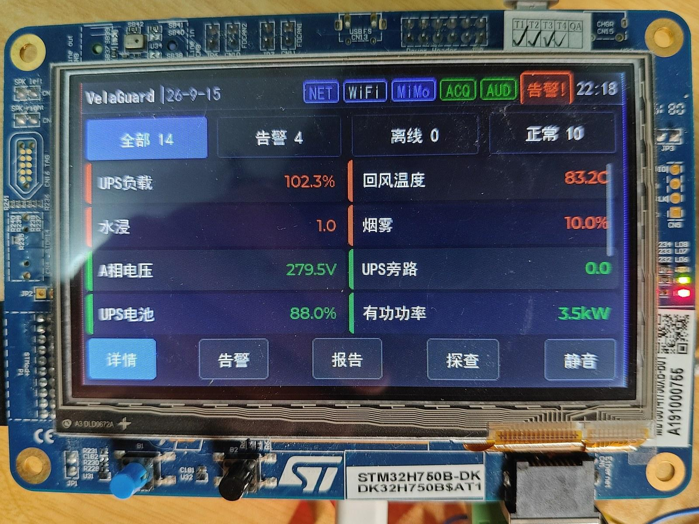

图 1  官方邮寄的 STM32H750B-DK 运行 VelaGuard 首页

#### 技术难点

第一项是单核资源预算。同一颗 Cortex-M7 上要同时跑图形刷新、总线采集、网络协议栈、TLS 加密连接和 openvelaClaw 工具轮次，这些组件共用同一块 AXI SRAM。趋势页把单点历史从 16 点加深到 128 点后，实测 BSS 增量恰好 28672 字节（符号区从 0x4e00 到 0xbe00），整机片内 SRAM 占用 216.9 KB，为 512 KB 的 41.4%；显示帧缓冲位于外部存储器，不占片内空间。芯片手册只给出 SRAM 容量上限，不给出各组件运行时的实际占用，这类预算由实测占用决定。 [41](https://github.com/open-vela/contest2026_004_TeamFalcons/blob/dev-ai-contest-2026/logs/Foleaf/2026-09-13/zcode__sess_51ca6bfc-664a-4e94-86d7-9f11e9249397.jsonl)

第二项来自启动方式。固件从 QSPI 外部闪存原地执行，运行期不能擦写正在取指的闪存：退出 memory-mapped 模式的那一刻，任何仍从该区域取指的代码（含中断服务程序）会当场失效。这条约束同时决定了两件事，启动链必须拆成片内启动代码与外部执行镜像两部分，以及 OTA 的擦写只能交给片内执行的启动代码完成。 [32](https://github.com/open-vela/contest2026_004_TeamFalcons/blob/dev-ai-contest-2026/docs/stm32h750b_dk_qspi_xip_deep_dive.md) [34](https://github.com/open-vela/contest2026_004_TeamFalcons/blob/dev-ai-contest-2026/docs/adr/0005-mqtt-only-pull-based-ota.md)

第三项是板卡标称与实测的落差。板级说明写的 128 MB SDRAM 是颗粒容量，实际走线为 16 位，只有 8 MB 可访问；片内 Flash 实际只有 128 KB。链接脚本若沿用同系列更大容量型号的模板，会把片内 Flash 声明为 2048 KB，这类偏差在编译期不报错，只在烧录或运行期暴露。 [32](https://github.com/open-vela/contest2026_004_TeamFalcons/blob/dev-ai-contest-2026/docs/stm32h750b_dk_qspi_xip_deep_dive.md)

第四项是存储的掉电语义。eMMC 使用 FAT 文件系统，它不提供写入原子性，写到一半的断电可能留下结构损坏的文件。点表、规则与网络配置因此不能依赖文件系统语义，必须由应用自己实现原子提交；而周期性的界面刷新与 485 半双工时序，又让采集线程、界面线程与网络线程之间的并发成为常态而非例外。 [33](https://github.com/open-vela/contest2026_004_TeamFalcons/blob/dev-ai-contest-2026/docs/velaguard-bringup-known-issues.md) [38](https://github.com/open-vela/contest2026_004_TeamFalcons/blob/dev-ai-contest-2026/logs/Foleaf/2026-09-12/zcode__sess_6448542d-e981-473d-ac34-0e26280bdaba.jsonl)

#### 创新点

第一是本地安全环。采集、阈值与离线判定、告警状态和显示路径都由确定性 C 代码负责，点表与实际读数决定告警，模型回答不参与触发或恢复。离线判定用最近 8 轮的滑动窗口失败率替代连续失败计数，让顺序到达的单次抖动不再翻转状态。 [1](https://github.com/open-vela/contest2026_004_TeamFalcons/blob/dev-ai-contest-2026/app/velaguard/vg_alarm_eval.c) [3](https://github.com/open-vela/contest2026_004_TeamFalcons/blob/dev-ai-contest-2026/app/velaguard/vg_ui_backend_board.c) [38](https://github.com/open-vela/contest2026_004_TeamFalcons/blob/dev-ai-contest-2026/logs/Foleaf/2026-09-12/zcode__sess_6448542d-e981-473d-ac34-0e26280bdaba.jsonl)

第二是点表的人工确认闸门。候选点表与采集点表分开，编辑和试读不会直接更换运行中的点表；操作员看到试读结果后，单独执行带 --confirm 的生效命令。测试读取与生效分属两条命令，固件不会在试读成功后自动提交。 [2](https://github.com/open-vela/contest2026_004_TeamFalcons/blob/dev-ai-contest-2026/app/velaguard/vgpoint.c) [10](https://github.com/open-vela/contest2026_004_TeamFalcons/blob/dev-ai-contest-2026/docs/velaguard-host-nsh-protocol.md)

第三是边界明确的运营助手。openvelaClaw 只做查询和解释，可调用的命令在 C 层按允许表限制，文件访问限定在数据目录内。模型结论与本地规则结论在界面上分开标注；已落实的边界见图 6，尚未落实的部分见 3.7。 [4](https://github.com/open-vela/contest2026_004_TeamFalcons/blob/dev-ai-contest-2026/app/velaguard/vg_agent_seed.c) [19](https://github.com/open-vela/packages_ai_agent/pull/32)

第四是端端与端云分工。板端、Windows 点表上位机与只读云看板构成三端协作：电脑负责生成和确认配置，板端负责本地判断与解释，云端只做留档与检索，三者通过串口协议与 MQTT 四类主题解耦。 [28](https://github.com/FoLeaf/velaguard_mimo2mqtt) [30](https://github.com/FoLeaf/velaguard_host)

### 3.2 系统方案设计

#### 系统总体架构

系统由现场 Modbus 从站、H750B-DK 网关和联网服务组成。现场从站提供寄存器数据；openvela 网关负责主站采集、配置管理、图形界面与 openvelaClaw 运行。MiMo 提供云端推理，MQTT Broker 接收设备上报。LVGL 是嵌入式图形组件库；openvelaClaw 是基于 openvela 的 AI Agent 智能引擎，也就是 openvela 的端侧 AI Agent 框架，代码包名为 packages/ai_agent，本作品在该框架上运行一组边界明确的工具。电脑用于上位机配置、开发和救援；云端另有只读看板，订阅四类主题并留存历史，不向设备下发命令。

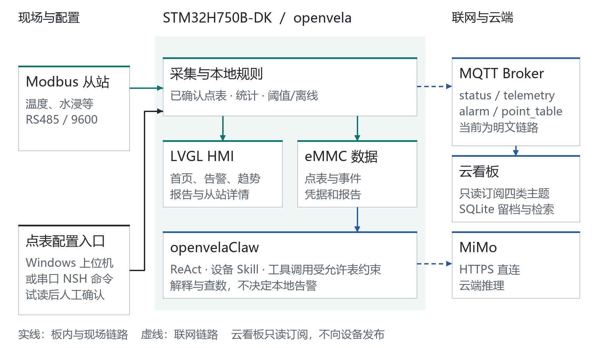

图 2  系统总体架构：现场、板端与云端的职责分工

图 2 给出的是职责分工，实际联调时的接线关系见图 3：网关主板同时接一路真实 Modbus 从站（RS485 温湿度变送器）与一路 RS485 转 USB 的总线模拟器，周期采集与人工试读共用这条半双工总线。

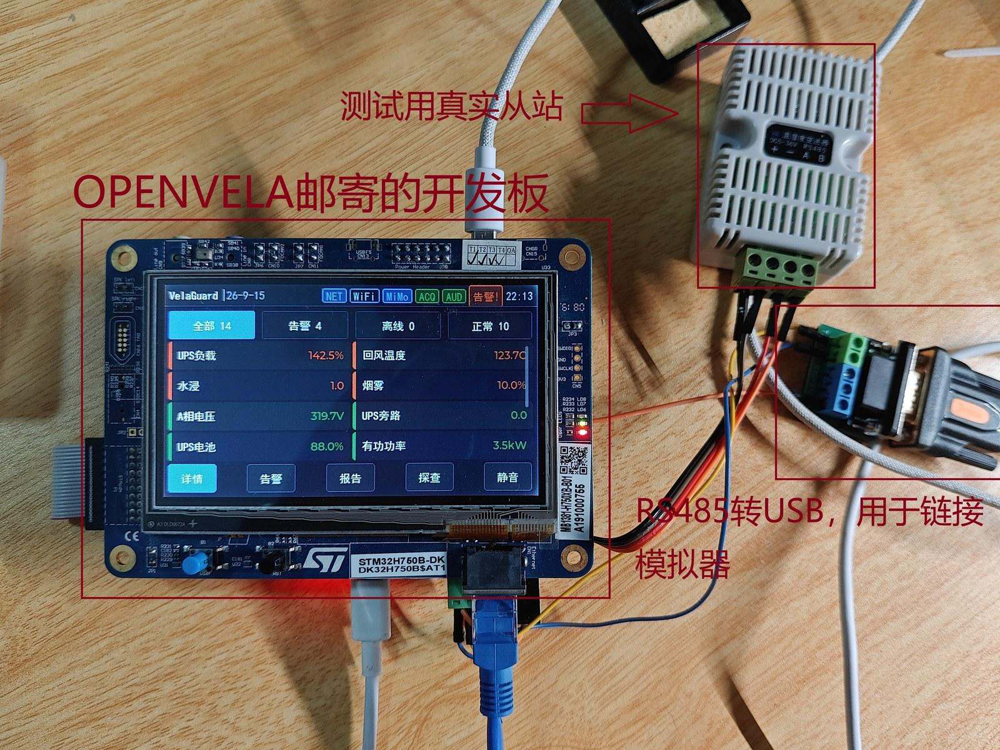

图 3  实物联调拓扑：网关、真实 Modbus 从站与总线模拟器

#### 方案论证与选型

项目选用 openvela 已支持的 STM32H750B-DK，板载显示、触摸、QSPI、SDRAM、eMMC 和以太网接口都能直接用。另加一台长期在线电脑，会把采集与现场显示继续交给主机；把屏幕和网关拆成多个节点，又会多出同步和部署环节。同板实现少了这些问题，但内存预算更紧。 [9](https://github.com/open-vela/contest2026_004_TeamFalcons/blob/dev-ai-contest-2026/docs/velaguard-expansion-board.md) [19](https://github.com/open-vela/packages_ai_agent/pull/32)

openvelaClaw 的 llm_proxy 发起大模型请求，通过 OpenAI 兼容 HTTPS 接口直连 MiMo。设备凭据由 vgprovision 管理并加密保存在 eMMC，产品固件不内置可用 API key。该选择使 LLM 请求不依赖另建的 MQTT AI 转发服务。 [7](https://github.com/open-vela/contest2026_004_TeamFalcons/blob/dev-ai-contest-2026/app/velaguard/vg_provision.c) [19](https://github.com/open-vela/packages_ai_agent/pull/32)

本地有周期采集、规则告警、配置读写、运行统计和 LVGL 显示。断网时这些路径不依赖模型；告警解释和自然语言查询才需要 MiMo 在线。屏幕上的报告分两种来源：模型生成的当日日报经板端校验后显示，固件统计的 runtime-report.md 作为断网与校验失败时的兜底，页面会写明当前是哪一种。 [1](https://github.com/open-vela/contest2026_004_TeamFalcons/blob/dev-ai-contest-2026/app/velaguard/vg_alarm_eval.c) [3](https://github.com/open-vela/contest2026_004_TeamFalcons/blob/dev-ai-contest-2026/app/velaguard/vg_ui_backend_board.c) [5](https://github.com/open-vela/contest2026_004_TeamFalcons/blob/dev-ai-contest-2026/app/velaguard/vg_runtime.c)

有两项方案在设计阶段被否决，理由都是现场可靠性。一是波特率矩阵扫描：本机只有一个串口，任一时刻只能工作在一种波特率上，列入更多档位只会拉长扫描时间而不提高命中率，当前固定 9600。二是让模型识别设备型号来推断寄存器语义：工业现场以供应商手册为准，模型识别无法保证准确率，因此点表仍由人工按手册配置并用试读验证。 [44](https://github.com/open-vela/contest2026_004_TeamFalcons/blob/dev-ai-contest-2026/logs/Foleaf/2026-08-25/cursor__2d65c3b9-8cdc-4237-bfcb-8493004ff772.jsonl)

联网侧不再自建 AI 转发服务：板端 openvelaClaw 经 HTTPS 直连 MiMo，MQTT 只承载状态与数据，供只读看板消费。上位机做成 Windows 图形程序，直接使用板端已有的 vgpoint 协议，不为每台现场笔记本再部署运行时。三个部分各自可单独替换，也不增加板端的内存负担。 [28](https://github.com/FoLeaf/velaguard_mimo2mqtt) [30](https://github.com/FoLeaf/velaguard_host)

#### 关键模块设计

表 1  模块职责与输入输出

| 模块 | 职责 | 主要输入与输出 |
| --- | --- | --- |
| 采集与点表 | RS485 主站读取已确认点表 | 寄存器读数、有效性、最近更新时间 |
| 规则与统计 | 阈值、离线、帧质量和运行累计 | 告警状态、异常记录、pending 文件 |
| LVGL HMI | 现场查看与逐点操作 | 首页、告警、趋势、报告、从站详情 |
| openvelaClaw | 按 Skill 调用工具并组织解释 | 问题或待处理告警 → 工具证据 → 文本 |
| 网络与 MQTT | 单活动链路管理及设备上报 | status、telemetry、alarm、point_table |
| 上位机（配套） | 编辑与导入候选点表，试读后确认 | vgpoint 协议命令、实时读数快照 |
| 云看板（配套） | 只读订阅四类主题并留档检索 | SQLite 历史、中文网页查询 |

RJ45 是主链路，ESP-01S 备用，固件维护连接状态、健康检查和失败退避。MQTT 走明文测试链路，只承载状态与数据，LLM 请求另走 HTTPS 直连。板端验收四项断言全部通过（PASS=4 FAIL=0），涵盖设备标识、链路状态、以太网地址与 mqtt 在线。 [6](https://github.com/open-vela/contest2026_004_TeamFalcons/blob/dev-ai-contest-2026/app/velaguard/vg_net_mgr.c) [8](https://github.com/open-vela/contest2026_004_TeamFalcons/blob/dev-ai-contest-2026/app/velaguard/vg_mqtt_session.c) [20](https://github.com/open-vela/contest2026_004_TeamFalcons/blob/dev-ai-contest-2026/docs/velaguard-mqtt-contract.md) [21](https://github.com/open-vela/contest2026_004_TeamFalcons/blob/dev-ai-contest-2026/docs/submission/evidence/mqtt-nsh-accept-20260914.log)

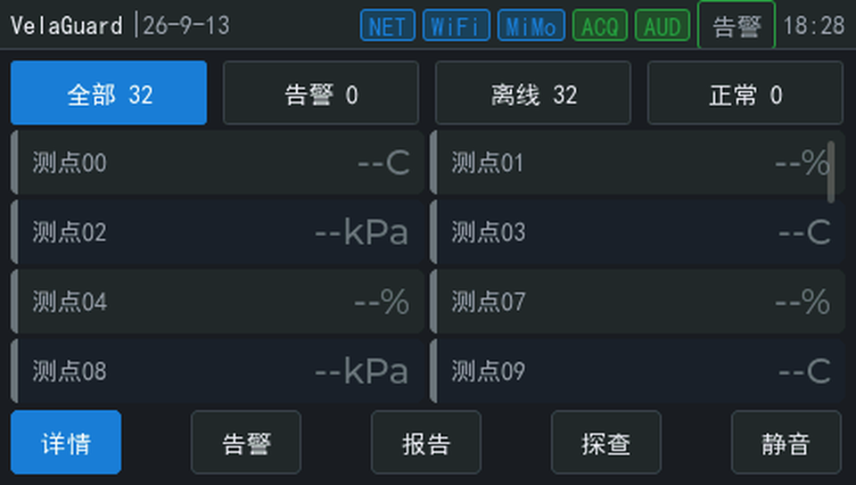

图 4  板端首页：32 个点位的快照与状态栏

首页按告警、离线、正常三态过滤点位，顶栏汇总网络、采集与告警状态。点表上限为 32 个点位，扫描地址同为 1 到 32；帧统计按从站分桶，最多 8 个从站，每桶保留最近 64 帧。上图由无头用例驱动真实 LVGL 代码渲染，板端屏幕分辨率为 480×272。 [25](https://github.com/open-vela/contest2026_004_TeamFalcons/blob/dev-ai-contest-2026/gui/main/ui/pages/vg_page_trend.c) [14](https://github.com/open-vela/contest2026_004_TeamFalcons/blob/dev-ai-contest-2026/.trellis/tasks/09-13-hmi-runtime-render/research/runtime-results.md)

### 3.3 核心算法与技术原理

#### openvelaClaw 的推理链路与工具轮次

推理在云端完成，设备端负责会话、Skill 加载与工具调用，本节的量化集中在接口、轮次与工具次数。MiMo 通过 /v1/chat/completions 接口和 Bearer 鉴权提供推理；openvelaClaw 在板上维护会话、加载 Skill，并运行 ReAct 循环。Skill 是约定任务步骤与约束的 Markdown 文件。ReAct 指模型根据工具返回的结果继续推理，直到形成回答或达到轮次限制。 [7](https://github.com/open-vela/contest2026_004_TeamFalcons/blob/dev-ai-contest-2026/app/velaguard/vg_provision.c) [19](https://github.com/open-vela/packages_ai_agent/pull/32)

以告警解释为例，Skill 规定先用帧统计、寄存器和配置摘要取证，再把逐点说明写入 alarm_advice.txt；告警数据随请求下发，避免为取数据单独读文件而触发框架的单文件短路。数据缺失必须保留不确定性，不能用推测补齐真实读数。工具调用与拦截通过框架的系统日志记录。 [4](https://github.com/open-vela/contest2026_004_TeamFalcons/blob/dev-ai-contest-2026/app/velaguard/vg_agent_seed.c) [19](https://github.com/open-vela/packages_ai_agent/pull/32)

#### 阈值与离线的确定性判定

阈值规则支持 ge、le、eq 三种比较，区分 warn 预警与 crit 严重告警，等值比较使用 0.0005 的数值容差，避免浮点比较在边界上抖动。同一时刻允许多个告警并存，首页按严重、离线、预警的顺序选取主要告警。 [1](https://github.com/open-vela/contest2026_004_TeamFalcons/blob/dev-ai-contest-2026/app/velaguard/vg_alarm_eval.c)

离线判定采用滑动窗口失败率，取代早期的连续失败计数。旧规则连续 3 轮读失败即判离线，按每轮 200 毫秒计算约 0.6 秒；485 总线上任何 0.6 秒的瞬时抖动都会翻转状态，抖动过去又立刻恢复，形成告警震荡。新规则为每个点位维护最近 8 轮的失败位环（约 1.6 秒），窗口内失败数达到 max(fail_n, 5) 才判离线，上限为窗口长度 8；读到一次正常值即清空该位并恢复。拔线时百分之百失败，仍能在约 1.0 秒内触发，演示节拍不受影响。两种规则在典型现象下的差别见图 5。 [37](https://github.com/open-vela/contest2026_004_TeamFalcons/blob/dev-ai-contest-2026/gui/main/ui/model/vg_model.c) [38](https://github.com/open-vela/contest2026_004_TeamFalcons/blob/dev-ai-contest-2026/logs/Foleaf/2026-09-12/zcode__sess_6448542d-e981-473d-ac34-0e26280bdaba.jsonl)

这一改动同时暴露了采样端的缺陷：界面每秒重复采样同一份轮询快照，一次真实失败会被计入窗口两到五次，而恢复只需一次成功，两侧不对称使离线状态来回跳。修复方式是给每份快照编号，界面只在编号变化时消费一次。查询命令与周期采集共用同一条半双工总线，因此读取前先取总线锁，1 秒内取不到就跳过该轮，避免两者在半双工链路上互相打断。 [38](https://github.com/open-vela/contest2026_004_TeamFalcons/blob/dev-ai-contest-2026/logs/Foleaf/2026-09-12/zcode__sess_6448542d-e981-473d-ac34-0e26280bdaba.jsonl)

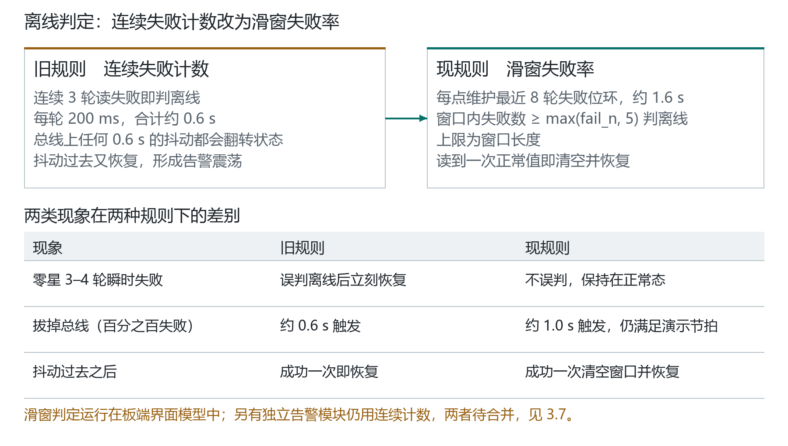

图 5  离线判定由连续失败计数改为滑窗失败率

点表变更走人工确认闸门。候选点表先经过字段检查与试读，操作者查看实际读数后再单独确认生效；vgpoint apply 的 C 实现要求 --confirm，编辑与试读命令不调用这一提交路径。试读记录与生效版本的强绑定尚未实现。 [2](https://github.com/open-vela/contest2026_004_TeamFalcons/blob/dev-ai-contest-2026/app/velaguard/vgpoint.c) [10](https://github.com/open-vela/contest2026_004_TeamFalcons/blob/dev-ai-contest-2026/docs/velaguard-host-nsh-protocol.md)

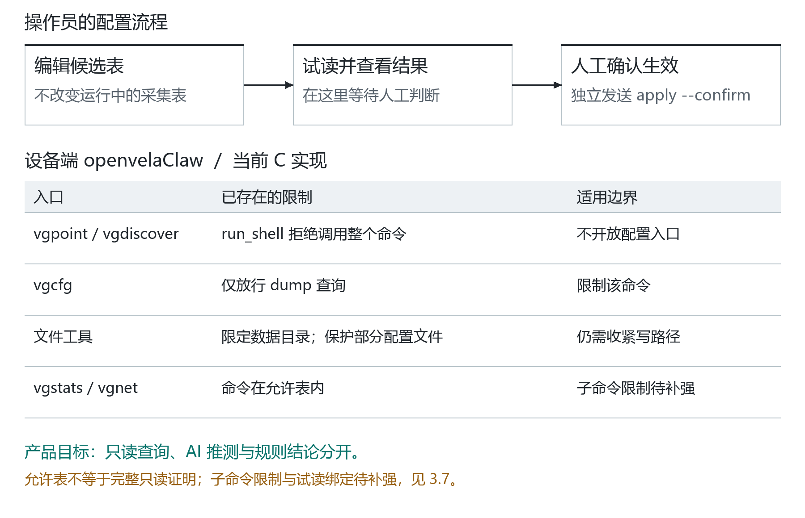

图 6  本地安全环与点表人工确认闸门

#### 总线探查与寄存器解码

探查由本地 C 代码完成，不经过模型。当前固定 9600 波特率，在 1 到 32 号地址上逐个发最小请求探活；命中后按寄存器块步进试读，块内寄存器数量按 16、2、1 逐级回退，以兼容寄存器区间很窄的从站。上限为 32 个从站、16 个寄存器块和 32 个点位，结果先写入候选点表文件，执行带 --confirm 的生效命令后才进入配置槽，流程见图 7。 [35](https://github.com/open-vela/contest2026_004_TeamFalcons/blob/dev-ai-contest-2026/app/velaguard/vg_point_table.c) [36](https://github.com/open-vela/contest2026_004_TeamFalcons/blob/dev-ai-contest-2026/app/velaguard/vg_discover_modbus.c)

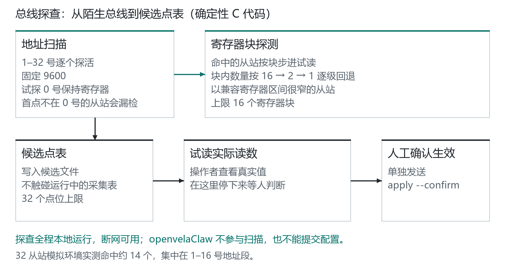

图 7  总线探查：从陌生总线到候选点表

探活只试读 0 号保持寄存器，因此首点不在 0 号地址的从站会被漏掉。对 32 个模拟从站的实测命中约 14 个，集中在 1 到 16 号地址段。 [33](https://github.com/open-vela/contest2026_004_TeamFalcons/blob/dev-ai-contest-2026/docs/velaguard-bringup-known-issues.md)

寄存器解码目前只实现了 int16 乘以倍率一种，即把有符号 16 位原始值换算为工程量。点表模型本身支持 5 种数据类型与 ABCD、CDAB 两种字序，选择 32 位类型时长度自动置为 2 个寄存器并出现字序选项，录入时校验取值合法性。多候选的自动求解尚未实现。 [35](https://github.com/open-vela/contest2026_004_TeamFalcons/blob/dev-ai-contest-2026/app/velaguard/vg_point_table.c) [37](https://github.com/open-vela/contest2026_004_TeamFalcons/blob/dev-ai-contest-2026/gui/main/ui/model/vg_model.c)

#### 帧级质量统计与故障归因

帧统计按从站分桶，最多 8 个从站，每桶保留最近 64 帧的滑动窗口，把每次读取归入成功、CRC 错、超时、回声和其他五类，并记录成功帧延迟的最小值、最大值与均值，另有一套开机以来的累计计数。其中回声帧指收到自己发出的字节，是半双工方向控制时序出错的直接证据。 [3](https://github.com/open-vela/contest2026_004_TeamFalcons/blob/dev-ai-contest-2026/app/velaguard/vg_ui_backend_board.c)

这些计数是告警与排障的证据来源：链路劣化告警由帧统计越限触发，而 485 故障归因按设计是一张确定性决策表，把全部从站不响应、CRC 错随总线加长而增多、错误集中在长帧、响应延迟抖动大、收到回声帧等九类现象，分别映射到接线与供电、终端电阻缺失、波特率失配、总线竞争和方向时序等原因。扩展板的终端电阻为跳线可切，波特率可配且有多个从站，其中五类可以用真实硬件复现验证。归因规则库尚未交付。 [33](https://github.com/open-vela/contest2026_004_TeamFalcons/blob/dev-ai-contest-2026/docs/velaguard-bringup-known-issues.md)

#### 掉电安全的配置提交

eMMC 上的 FAT 文件系统不提供写入原子性，因此配置采用双槽提交。点表、规则与网络配置各写两份，每份带 schema 版本、单调递增序号、CRC32 与提交标记。写入顺序是先写非活动槽并同步落盘，再更新序号与校验值并再次同步，最后写提交标记。启动时选取序号最大且校验通过的一份，两份都损坏时回退出厂默认并在界面明确提示。这套顺序是配置文件在任意时刻断电后仍能启动的依据。 [33](https://github.com/open-vela/contest2026_004_TeamFalcons/blob/dev-ai-contest-2026/docs/velaguard-bringup-known-issues.md)

#### QSPI XIP 约束下的 OTA 设计

固件从 QSPI 外部闪存原地执行，运行期无法擦写正在取指的闪存，升级不能由应用态直接完成。设计形态是应用经 MQTT 分片把新镜像拉取到 eMMC，校验摘要与签名后置升级标志并重启，由片内 Flash 中的启动代码完成擦写与跳转；新固件自检通过才确认，自检失败则从 eMMC 上保留的旧镜像回滚。片内 128 KB Flash 当前只用了不到 1 KB，容纳这段启动代码有余。启动链与升级路径的关系见图 8；该链路依赖 eMMC 先稳定可用，尚未交付。 [32](https://github.com/open-vela/contest2026_004_TeamFalcons/blob/dev-ai-contest-2026/docs/stm32h750b_dk_qspi_xip_deep_dive.md) [34](https://github.com/open-vela/contest2026_004_TeamFalcons/blob/dev-ai-contest-2026/docs/adr/0005-mqtt-only-pull-based-ota.md)

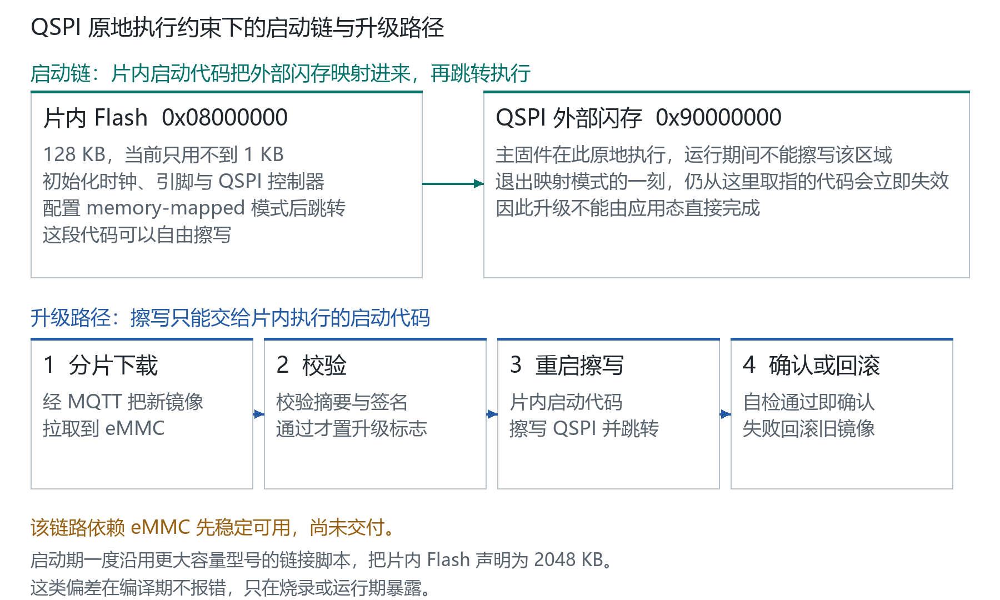

图 8  QSPI 原地执行约束下的启动链与升级路径

#### openvela 能力与资源组织

图形部分由 LVGL 页面、模型快照和显示触摸驱动配合完成。采集结果通过受保护的快照交给 UI，报告读写和 pending 文件操作由后台工作线程处理。页面按变化刷新，保留固定对象和监听器，减少静止页面的重复提交。趋势页保留单点历史曲线与阈值线，板端历史深度 128 点，可切换最近 60 点窗口，越限点单独着色。 [3](https://github.com/open-vela/contest2026_004_TeamFalcons/blob/dev-ai-contest-2026/app/velaguard/vg_ui_backend_board.c) [13](https://github.com/open-vela/contest2026_004_TeamFalcons/blob/dev-ai-contest-2026/.trellis/tasks/09-13-hmi-ux-performance/research/final-results.md) [14](https://github.com/open-vela/contest2026_004_TeamFalcons/blob/dev-ai-contest-2026/.trellis/tasks/09-13-hmi-runtime-render/research/runtime-results.md) [25](https://github.com/open-vela/contest2026_004_TeamFalcons/blob/dev-ai-contest-2026/gui/main/ui/pages/vg_page_trend.c)

对照赛道要求，本作品落地了 openvela 系统能力中的图形与 AI 两项，多媒体能力未使用。图形部分使用 openvela 的 LVGL 图形栈、显示与触摸驱动，以及自绘的现场页面；AI 部分使用 openvelaClaw 框架的 ReAct 循环、Markdown Skill、Tool 与 Shell 调用，主动轮次由板端文件工作线程发起（心跳线程保留但不再触发模型调用），交互渠道为 NSH。 [19](https://github.com/open-vela/packages_ai_agent/pull/32)

赛题要的是能主动、会执行的嵌入式 AI Agent 应用。按官方的主动类型划分，本作品覆盖三类：告警集合变化后板端自动发起解释属事件主动，发现当天还没有日报时板端按天主动生成属定时主动，越限与离线判定属阈值主动；前两类的触发都来自板端而不是用户提问，产物分别是建议文件和日报文件。硬件方面，官方说明可以基于已适配 openvela 的硬件二次开发，本作品正是在这一范围内使用 STM32H750B-DK。 [19](https://github.com/open-vela/packages_ai_agent/pull/32)

AI 能力使用 openvelaClaw 的 llm_proxy、Skill 加载、心跳服务和 NSH 交互渠道。带屏配置将 openvelaClaw 主循环栈设为 32 KiB、上下文和流缓冲各设为 4 KiB，并按需启动主循环。 [19](https://github.com/open-vela/packages_ai_agent/pull/32)

公共仓里的改动涉及 QSPI 启动、板级接口、显示、触摸、网络与 openvelaClaw 适配。后续可以把资源受限 MCU 的栈和缓冲预算整理成配置组合，并加强工具参数、写路径和输出结构的检查。9 个 PR 的具体入口见表 4。

### 3.4 系统实现

#### 软件架构与启动

velaguard_app_main 托管 NSH 与产品业务，初始化配置和网络管理，安装设备 Skill，启动 HMI 后延迟启动 ai_agent --daemon。daemon 是后台常驻服务，NSH 是设备的命令行终端，可用 ai_agent 命令进入交互渠道。带屏自启已在实际启动记录中观察到，完整工具轮次的验证范围见 3.5。 [3](https://github.com/open-vela/contest2026_004_TeamFalcons/blob/dev-ai-contest-2026/app/velaguard/vg_ui_backend_board.c) [4](https://github.com/open-vela/contest2026_004_TeamFalcons/blob/dev-ai-contest-2026/app/velaguard/vg_agent_seed.c) [11](https://github.com/open-vela/contest2026_004_TeamFalcons/blob/dev-ai-contest-2026/docs/submission/evidence/report-evidence.json)

表 2  固件组成

| 层次 | 实现与职责 |
| --- | --- |
| 交互层 | LVGL 首页、告警、趋势、运行报告和探查页面；NSH 配置与查询命令 |
| 业务层 | 点表、Modbus 采集、帧统计、告警判定、运行统计、后台文件处理 |
| AI 层 | openvelaClaw 会话和 ReAct；Markdown Skill；llm_proxy 网络推理 |
| 系统与驱动 | openvela / NuttX 任务和文件系统；串口、网络、显示、触摸、QSPI 与 eMMC |

#### 四条数据路径

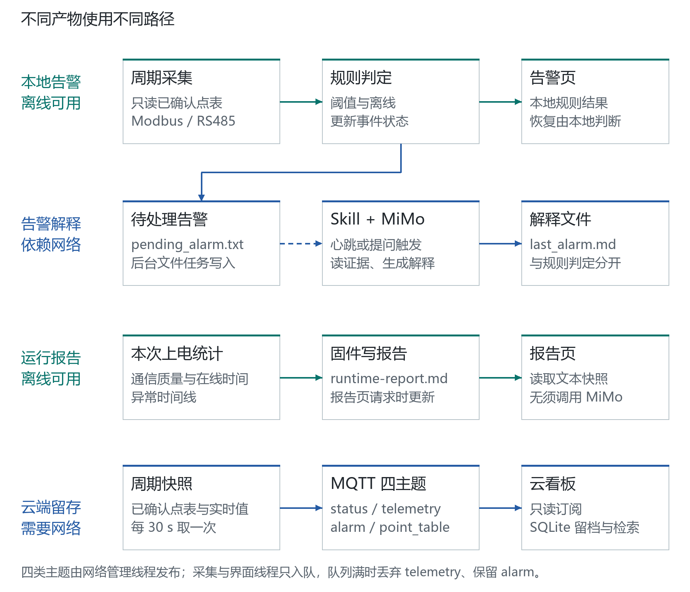

图 9  本地告警、联网解释、运行报告与云端留存的数据路径

周期采集读取已确认点表，规则计算当前状态，形成本地告警；HMI 展示告警，后台任务写入主要告警对应的 pending_alarm.txt。告警恢复后，由本地逻辑清理待处理文件并记录状态变化。 [1](https://github.com/open-vela/contest2026_004_TeamFalcons/blob/dev-ai-contest-2026/app/velaguard/vg_alarm_eval.c) [3](https://github.com/open-vela/contest2026_004_TeamFalcons/blob/dev-ai-contest-2026/app/velaguard/vg_ui_backend_board.c)

告警集合发生变化时，HMI 的文件工作线程按 alarm_interpretation Skill 发起一轮，请求里带全量告警数据与上电随机数、轮次序号；openvelaClaw 调只读命令取证后写 alarm_advice.txt，板端解析校验通过才放进内存缓存，告警页行内显示一行短建议、详情区显示完整解释并标注 AI 推测。心跳线程在 HMI 构建下不再直接发起模型轮次，避免两个不同步的触发源抢同一个回调槽。这条事件主动链路的板端验收见 3.5。 [4](https://github.com/open-vela/contest2026_004_TeamFalcons/blob/dev-ai-contest-2026/app/velaguard/vg_agent_seed.c) [3](https://github.com/open-vela/contest2026_004_TeamFalcons/blob/dev-ai-contest-2026/app/velaguard/vg_ui_backend_board.c)

vg_runtime 累计本次上电以来的通信质量、点位在线时间和异常记录，仍是报告页的离线兜底来源：文件工作线程在时钟同步、当天还没有日报时主动发起一轮，operations_report Skill 用 get_current_time、vgruntime dump、vgstats dump 取真实数字，写出 daily-当日日期.md；板端校验首行标记、日期、来源与长度后采纳，报告页标题显示 OPENVELACLAW 署名，否则回退 runtime-report.md 并标注本地来源。runtime-report.md 在 C 层对 Agent 只读，兜底内容不会被覆盖。 [3](https://github.com/open-vela/contest2026_004_TeamFalcons/blob/dev-ai-contest-2026/app/velaguard/vg_ui_backend_board.c) [4](https://github.com/open-vela/contest2026_004_TeamFalcons/blob/dev-ai-contest-2026/app/velaguard/vg_agent_seed.c) [5](https://github.com/open-vela/contest2026_004_TeamFalcons/blob/dev-ai-contest-2026/app/velaguard/vg_runtime.c)

已确认点表的周期快照按 status、telemetry、alarm、point_table 四类主题上报，由网络管理线程统一发布；采集与界面线程只入队，队列满时丢弃 telemetry、保留 alarm。四类主题的保留策略与投递等级不同：状态类周期发布并保留最后一条，遥测类不保留、按周期刷新最新一帧，告警类用至少一次投递、在内存中排队 8 条并在链路恢复后补发（断电不补），点表类保留最后一份已确认表。发送与接收缓冲分别为 8 KiB 与 512 字节，会话采用清理式连接，保活 60 秒。云看板只读订阅这四类主题，写入 SQLite 后供网页查询。 [8](https://github.com/open-vela/contest2026_004_TeamFalcons/blob/dev-ai-contest-2026/app/velaguard/vg_mqtt_session.c) [20](https://github.com/open-vela/contest2026_004_TeamFalcons/blob/dev-ai-contest-2026/docs/velaguard-mqtt-contract.md) [28](https://github.com/FoLeaf/velaguard_mimo2mqtt) [29](https://velaguard.19y.cc/) [42](https://github.com/open-vela/contest2026_004_TeamFalcons/blob/dev-ai-contest-2026/logs/Foleaf/2026-08-18/cursor__2b954b8a-3d21-4fb8-8fbd-54684a8360f1.jsonl)

这条链路上有一处容易误判的协议细节。MQTT-C 采用发送队列加同步泵的模型：连接调用只把报文放进队列，真正发送发生在同步调用内部，而同步的顺序是先接收后发送。第一次同步时连接报文尚未发出，却在等待连接确认，这在协议上是必然的空等一轮。以太网链路能自然度过这一轮，因为暂时无数据可读不算错误；而 ESP-01S 链路把超时直接映射为套接字错误，导致接收提前失败、发送永远执行不到，连接报文就一直没有发出去。定位后的修法是区分「暂时无数据」与「链路故障」两种语义，只在后者才判定为错误。 [42](https://github.com/open-vela/contest2026_004_TeamFalcons/blob/dev-ai-contest-2026/logs/Foleaf/2026-08-18/cursor__2b954b8a-3d21-4fb8-8fbd-54684a8360f1.jsonl)

#### 硬件设计与适配

本项目不做全新硬件平台适配，进行了驱动开发。主板是 openvela 已支持的 STM32H750B-DK，扩展方案通过 Arduino 与 STMod+ 接入 RS485 和 ESP-01S。接口映射已与 MB1381-B01 原理图第 14、16 页及当前 board.h 交叉核对；下表给出方案级关键器件。 [9](https://github.com/open-vela/contest2026_004_TeamFalcons/blob/dev-ai-contest-2026/docs/velaguard-expansion-board.md)

表 3  接口与关键器件

| 接口或模块 | 接线与实现 |
| --- | --- |
| RS485 | UART7 使用 PB4/D10 作为 TX，PA8/D5 作为 RX，PK1/D4 控制方向；3.3 V 收发器可选 SP3485/MAX3485 类，配终端电阻与总线保护。 |
| 备用 Wi-Fi | ESP-01S 经 USART2 的 PD5/PD6 接 STMod+，需对应焊桥选择与独立 3.3 V 供电。 |
| 显示与存储 | 使用主板 LCD/触摸、QSPI、SDRAM 与 eMMC；应用经 QSPI XIP 执行，配置和报告在 eMMC。 |
| 调试与输出 | ST-LINK 虚拟串口用于 NSH，不占用 RS485；扩展方案含低边 MOSFET 数字量输出，openvelaClaw 不负责控制。 |

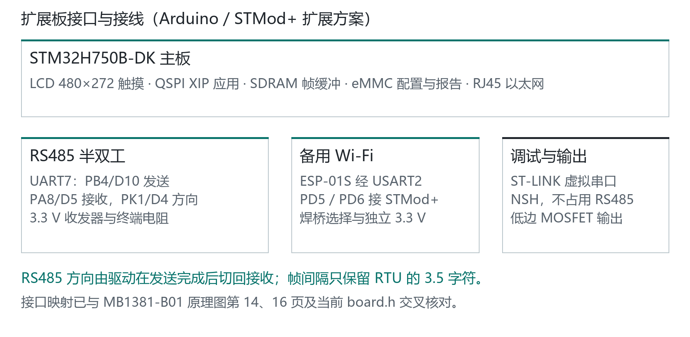

图 10  扩展板接口与接线（自绘，引脚级映射）

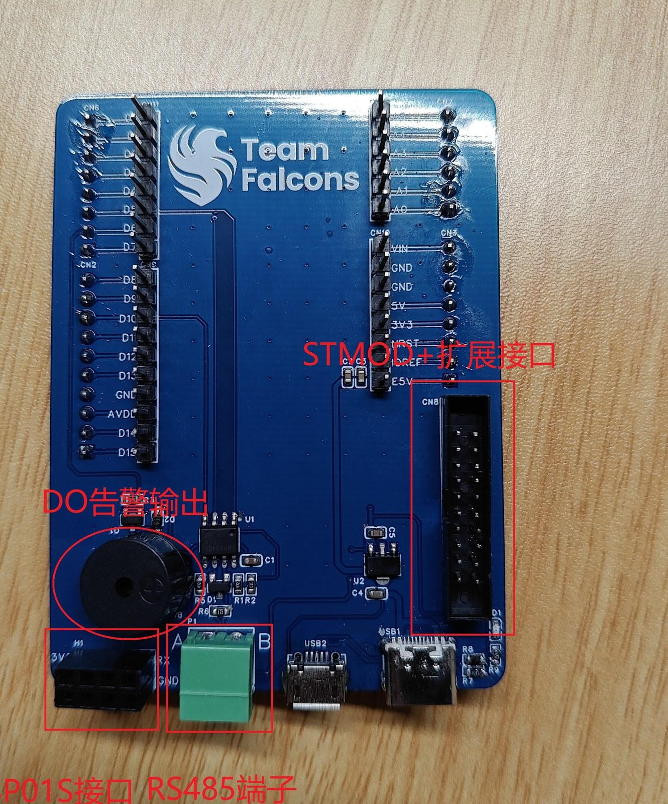

图 11  扩展板实物：STMOD+ 接口、DO 告警输出、ESP-01S 接口与 RS485 端子

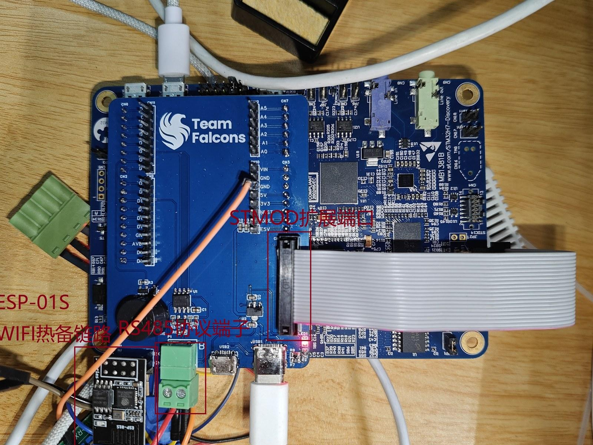

图 12  扩展板与主板的叠插关系

扩展板按主板的 Arduino 与 STMod+ 排针位置取形，直接叠插，不额外占用主板的调试与显示接口。RS485 收发、总线保护与数字量输出的电路见图 13，成品板卡布局见图 14：收发器为 MAX3485，A/B 线配 SM712 TVS 与可跳线的 120 欧终端电阻；数字量输出用 AO3400A 低边 MOSFET 驱动 2.7 kHz 蜂鸣器，并配 1N4148WS 续流二极管；板载 ME6118A33 提供 3.3 V。

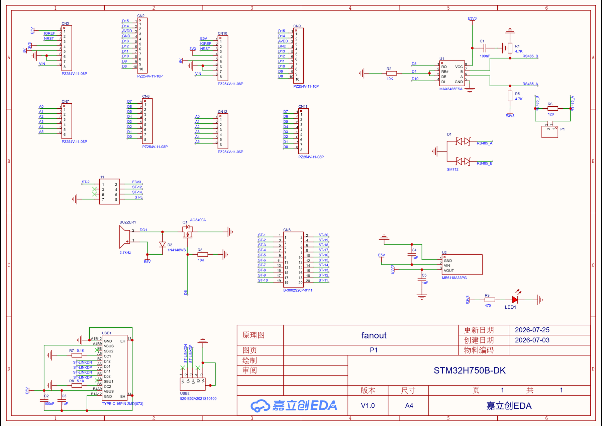

图 13  扩展板原理图：RS485 收发与总线保护、数字量输出与电源

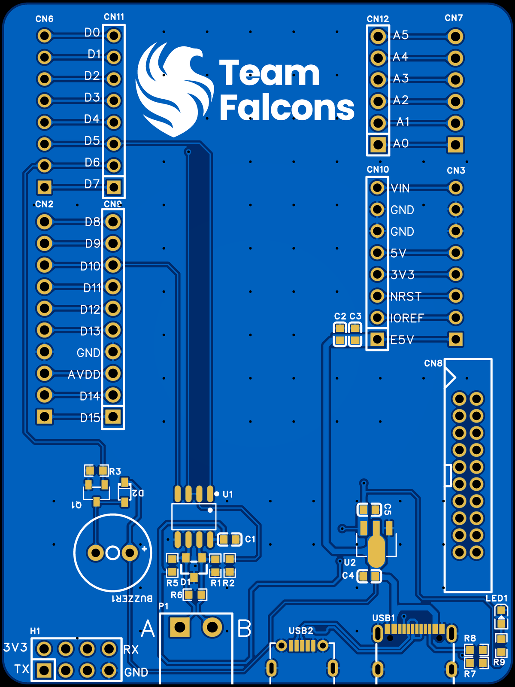

图 14  扩展板 PCB 布局

RS485 半双工的方向控制是一处实现难点。发送结束后，方向引脚必须等最后一个字节真正离开移位寄存器才能切回接收态，而 tcdrain 只保证软件发送缓冲区清空，不等发送完成标志。早期自测工具因此在 close 时触发驱动释放方向引脚，引脚被板上 10K 下拉电阻拉低、提前回到接收态，把帧尾切断，同一帧三次测试分别只剩 23、24、26 字节。当前实现改由发送完成中断控制方向，应用层不再依赖延时兜底；同时关闭该串口的发送 FIFO，因为 FIFO 开启后「发送寄存器空」的含义会与半双工所需的「发送完成」错位。 [33](https://github.com/open-vela/contest2026_004_TeamFalcons/blob/dev-ai-contest-2026/docs/velaguard-bringup-known-issues.md) [40](https://github.com/open-vela/contest2026_004_TeamFalcons/blob/dev-ai-contest-2026/logs/Foleaf/2026-08-13/codex__019ff91d-9f98-7103-a776-28773de6eaee.jsonl)

以太网存在一处引脚冲突。PH2 与 PH3 复用为以太网载波侦听与冲突检测信号，同时又是 QSPI bank2 的数据线；板子要从 QSPI 启动，这两脚必须让给 QSPI。解法分三步：声明本板不使用载波侦听与冲突检测（全双工以太网不需要这两路信号），把链路检测改为轮询 PHY 状态寄存器，以及允许先启动后插线，把自协商超时由失败改为成功返回、交给轮询去发现链路。轮询读取还有一个细节：该寄存器的链路位是低电平锁存，需要连读两遍才拿到当前值，并做两次采样防抖。这一方案成立的前提是自协商结果为全双工。 [39](https://github.com/open-vela/contest2026_004_TeamFalcons/blob/dev-ai-contest-2026/logs/Foleaf/2026-08-15/codex__019fffb5-e402-7633-877e-61b322ff444e.jsonl)

XIP 指程序直接从外部闪存取指执行，QSPI 启动解决片内启动代码与外部执行镜像的衔接；显示与触摸改动分别进入 LTDC 和 FT5x06 驱动，ESP8266 与 MQTT 改动留在其真实公共源码树中。以下 9 个 PR 的目标分支均为 dev-ai-contest-2026，当前状态均为 open。 [11](https://github.com/open-vela/contest2026_004_TeamFalcons/blob/dev-ai-contest-2026/docs/submission/evidence/report-evidence.json)

表 4  公共仓贡献入口

| 公共仓 PR | 主要内容 |
| --- | --- |
| [nuttx #350](https://github.com/open-vela/nuttx/pull/350) | 片内 boot stub 与 QSPI XIP 启动支持 |
| [nuttx #351](https://github.com/open-vela/nuttx/pull/351) | VelaGuard 扩展板接口与板级配置 |
| [nuttx #352](https://github.com/open-vela/nuttx/pull/352) | 网络、eMMC、RS485 和 ETH MII 的板级 bring-up |
| [nuttx #353](https://github.com/open-vela/nuttx/pull/353) | STM32H7 LTDC 显示加速 |
| [nuttx #354](https://github.com/open-vela/nuttx/pull/354) | FT5x06 触摸轮询性能改进 |
| [nuttx-apps #119](https://github.com/open-vela/nuttx-apps/pull/119) | 链路状态轮询、DHCP 续租及 ESP8266 LESP 兼容 |
| [MQTT-C #1](https://github.com/open-vela/apps_netutils_mqttc_MQTT-C/pull/1) | 带标记的 LESP send/recv 弱符号钩子 |
| [ai_agent #29](https://github.com/open-vela/packages_ai_agent/pull/29) | 守护进程附着、看门狗改用单调时钟与工具可靠性修复 |
| [ai_agent #32](https://github.com/open-vela/packages_ai_agent/pull/32) | H750 带屏内存配置与 VelaGuard 工具访问限制 |

#### 交互与设备 Skill

现场有三个交互入口：LVGL 触摸界面负责查看与逐点操作；NSH 提供候选点表编辑、试读、确认和实时值查询，在串口终端输入 ai_agent 即可进入 vela> 对话渠道；Windows 上位机把同一条串口流程做成图形界面。RS485 总线只由网关作为主站使用。配置完成后不要求电脑长期连接；自动扫描由确定性代码负责，界面扫描需由用户显式开启，openvelaClaw 不参与扫描或提交配置。 [2](https://github.com/open-vela/contest2026_004_TeamFalcons/blob/dev-ai-contest-2026/app/velaguard/vgpoint.c) [10](https://github.com/open-vela/contest2026_004_TeamFalcons/blob/dev-ai-contest-2026/docs/velaguard-host-nsh-protocol.md) [30](https://github.com/FoLeaf/velaguard_host)

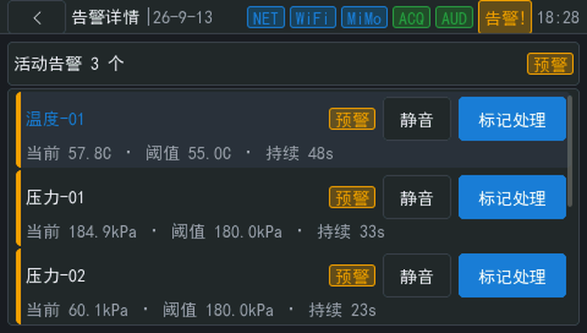

图 15  告警页：三行活动告警与逐点静音、标记处理

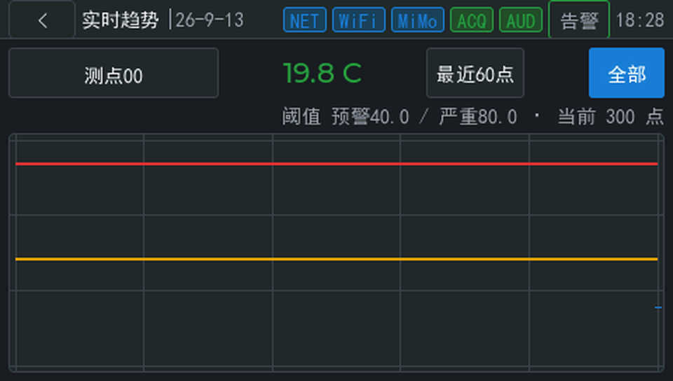

图 16  趋势页：阈值线与历史窗口切换

表 5  三份设备 Skill

| 文件 | 触发与数据 | 输出 |
| --- | --- | --- |
| alarm_interpretation.md | 板端在告警集合变化时发起，或用户问告警含义；数据随请求下发，再用统计、寄存器和配置摘要取证 | 逐点建议写入 alarm_advice.txt（VGADV1 行式格式），校验通过后上屏 |
| operations_report.md | 板端发现当天无日报时主动请求，或用户询问运行概况 | 用只读工具取真实数字，写出 daily-当日日期.md；不覆盖固件的 runtime-report.md |
| modbus_query.md | 用户查询寄存器、通信质量或运行累计；调用查询工具 | 返回工具支持的数据 |

三份 Skill 均为 Markdown 文件，由固件首次启动写入 /data/agent/skills/，约定任务过程，C 层工具实现负责真正的访问限制。自然语言查数是补充交互，使用演示见提交的演示视频。 [4](https://github.com/open-vela/contest2026_004_TeamFalcons/blob/dev-ai-contest-2026/app/velaguard/vg_agent_seed.c) [19](https://github.com/open-vela/packages_ai_agent/pull/32)

#### 配套项目：上位机与云看板

作品本体是专属仓内的固件；上位机与云看板是配套工具，独立成仓便于单独部署与替换，合起来构成设备、电脑、云端三端分工。 [10](https://github.com/open-vela/contest2026_004_TeamFalcons/blob/dev-ai-contest-2026/docs/velaguard-host-nsh-protocol.md) [28](https://github.com/FoLeaf/velaguard_mimo2mqtt) [30](https://github.com/FoLeaf/velaguard_host)

点表上位机（velaguard_host）是 Windows 图形程序，讲的是板端既有的 vgpoint NSH 协议：新增、导入、删除点位，随后试读候选值，操作员确认后落盘。落盘仍由板端 C 实现执行，仍要求 --confirm；上位机只是把同一条串口流程做成界面，「确认落盘」在界面上单独标为醒目操作。 [10](https://github.com/open-vela/contest2026_004_TeamFalcons/blob/dev-ai-contest-2026/docs/velaguard-host-nsh-protocol.md) [30](https://github.com/FoLeaf/velaguard_host)

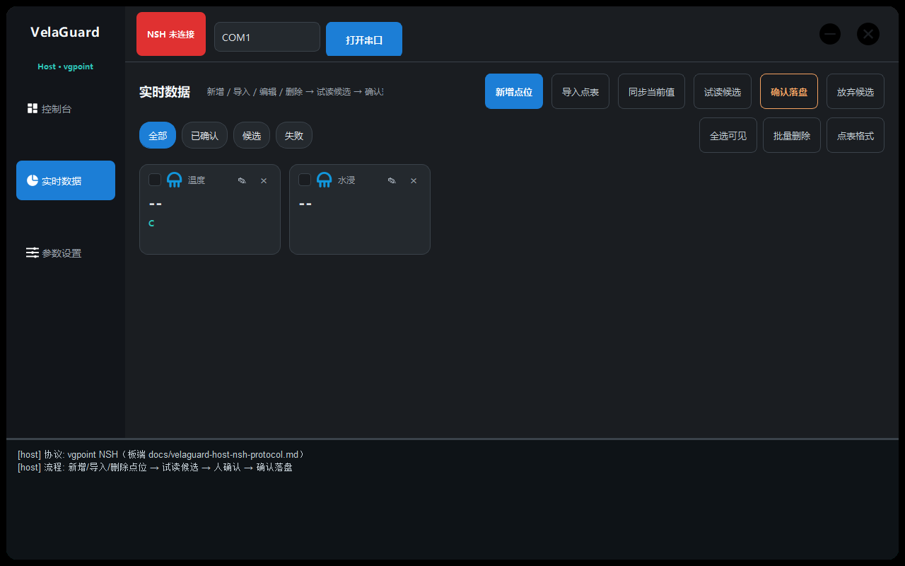

图 17  点表配置上位机：编辑、试读与人工确认

云看板（velaguard_mimo2mqtt）是独立部署的只读服务，在线地址为 velaguard.19y.cc。采集器订阅 vg/{device_id}/status、telemetry、alarm、point_table 四类主题，写入 SQLite，网页端用中文界面查询设备总览、实时值、时序趋势与告警历史。服务只提供 GET 接口，从不向设备主题发布，也不清告警；入口为 vg-dashboard。设备总览见图 18，单台设备的实时数据页见图 19。 [20](https://github.com/open-vela/contest2026_004_TeamFalcons/blob/dev-ai-contest-2026/docs/velaguard-mqtt-contract.md) [28](https://github.com/FoLeaf/velaguard_mimo2mqtt) [29](https://velaguard.19y.cc/)

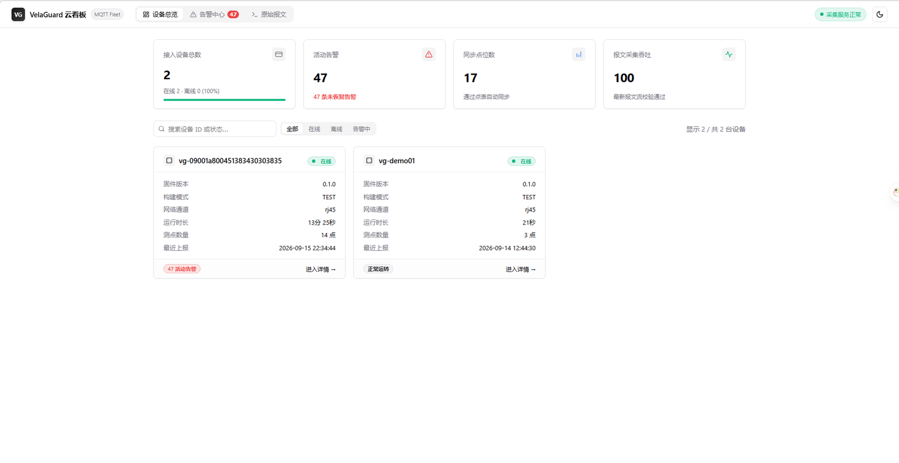

图 18  云看板设备总览：在线设备、活动告警与报文采集校验

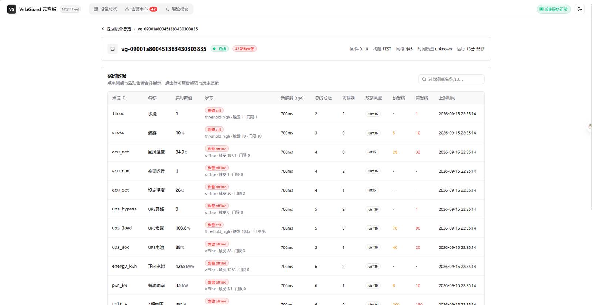

图 19  云看板设备实时数据页：点位状态、总线地址、寄存器与阈值；该页取自已确认点表的联调样例，部分点位未接真实从站，故显示离线

两个配套项目与板端的分工是单向的：电脑能改配置，云端只能看。板端 openvelaClaw 既不改配置，也不写云端。 [4](https://github.com/open-vela/contest2026_004_TeamFalcons/blob/dev-ai-contest-2026/app/velaguard/vg_agent_seed.c) [28](https://github.com/FoLeaf/velaguard_mimo2mqtt)

#### 复现入口

需要包含 nuttx、apps 和 packages 的完整 openvela 工作区，并按专属仓 manifest 接入产品目录。在本仓根目录执行 bash scripts/build.sh，默认构建 velaguard-lvgl。公共树改动按表 4 核对；本仓构建脚本不会替公共树应用补丁。主机测试入口为 make -C app/velaguard/host_tests test，当前 13 个用例覆盖网络策略、配置存储、帧统计、运行统计、探查、点表、告警判定、时间同步、AI 文本契约、HMI 性能、运行渲染、交互调度与 MQTT 载荷；无头界面用例用 ctest 运行，覆盖告警、趋势、夹具、生命周期刷新与交互检查。上位机与云看板各自按仓内 README 运行。本仓源码遵循 Apache 2.0，内置的 nanoMODBUS 保留其 MIT 许可。 [16](https://github.com/open-vela/contest2026_004_TeamFalcons/blob/dev-ai-contest-2026/scripts/build.sh) [23](https://github.com/open-vela/contest2026_004_TeamFalcons/blob/dev-ai-contest-2026/app/velaguard/host_tests/Makefile) [30](https://github.com/FoLeaf/velaguard_host)

### 3.5 系统测试与结果分析

#### 测试环境与证据范围

带屏性能记录取自 STM32H750B-DK，通过 bash scripts/build.sh --hmi-perf 构建测量固件，首页装载 14 个已确认点位，采集线程运行、无触摸。该次记录中 live ok=0/14，无成功实读。openvelaClaw 日报记录另来自历史无屏固件，两组结果不混为同一固件验收。 [11](https://github.com/open-vela/contest2026_004_TeamFalcons/blob/dev-ai-contest-2026/docs/submission/evidence/report-evidence.json) [12](https://github.com/open-vela/contest2026_004_TeamFalcons/blob/dev-ai-contest-2026/.trellis/tasks/archive/2026-08/08-30-stage1-agent-ops/research/agent-ops-notes.md) [13](https://github.com/open-vela/contest2026_004_TeamFalcons/blob/dev-ai-contest-2026/.trellis/tasks/09-13-hmi-ux-performance/research/final-results.md)

表 6  功能测试与实现核查

| 项目与日期 | 方法或条件 | 实际结果与证据 |
| --- | --- | --- |
| 主机测试 2026-09-17 复核 | app/velaguard/host_tests | 13 个用例编译运行通过，覆盖网络策略、配置存储、帧统计、运行统计、探查、点表、告警判定、时间同步、AI 文本契约、HMI 性能、运行渲染、交互调度与 MQTT 载荷；其中 AI 文本契约用例为 2026-09-17 新增。[23](https://github.com/open-vela/contest2026_004_TeamFalcons/blob/dev-ai-contest-2026/app/velaguard/host_tests/Makefile) |
| 无头界面测试 2026-09-13 18:28 | ctest，hmi-headless | 原始记录 5/5 通过，覆盖告警、趋势、夹具、生命周期刷新和交互检查；不能代替实体触摸验收。[11](https://github.com/open-vela/contest2026_004_TeamFalcons/blob/dev-ai-contest-2026/docs/submission/evidence/report-evidence.json) |
| MQTT 四主题板验 2026-09-14 11:14 | 板端串口脚本断言 | PASS=4 FAIL=0：设备标识由 UID 派生、vgnet 显示 mqtt=up、eth0 取得 192.168.137.47、运行日志出现 mqtt online。[20](https://github.com/open-vela/contest2026_004_TeamFalcons/blob/dev-ai-contest-2026/docs/velaguard-mqtt-contract.md)[21](https://github.com/open-vela/contest2026_004_TeamFalcons/blob/dev-ai-contest-2026/docs/submission/evidence/mqtt-nsh-accept-20260914.log) |
| 板端时间同步 2026-09-14 | 串口连续观察记录 | 16:16 至 21:17 约 5 小时，vgtime 校时成功 11 次，同段日志无断言失败或 panic。[22](https://github.com/open-vela/contest2026_004_TeamFalcons/blob/dev-ai-contest-2026/docs/submission/evidence/vgtime-board-20260914.log) |
| 带屏 openvelaClaw 自启 2026-09-13 | 启动串口日志 | 出现 ai_agent autostart ok、32768 字节栈和 daemon 启动信息；只证明服务自启。[11](https://github.com/open-vela/contest2026_004_TeamFalcons/blob/dev-ai-contest-2026/docs/submission/evidence/report-evidence.json) |
| 板端自主生成日报 2026-09-16 23:2x | 带屏固件，无人工提问 | 板端自行发起：日志 `vghmi: daily report requested` 与 `round submitted: 124 bytes`，工具行依次为 read_file、get_current_time、run_shell、run_shell、write_file，`END status=ok iters=4 tools=4 elapsed=194s`，产出 `daily-2026-09-16.md`（824 B），`vgagent status` 的 gen 由 0 增至 1。证据见本报告引用的任务 research 目录与串口记录。 |
| 告警逐点建议 2026-09-16 23:0x | 带屏固件，从站 1 离线告警 | Agent 写的 `alarm_advice.txt` 1840 B，首行 `VGADV1`、`boot=30bda344 req=15 n=8`，8 条均为 `sev=offline`，`sum`/`ev`/`att` 三字段齐全且引用了 vgstats 与 vgmodbus 的实际观测；板端另有 `agent_tools.log` 记录每次工具调用。 |
| 历史 openvelaClaw 日报 2026-08-30 | 无屏板端，手动 ask | END status=ok；6 轮、6 次工具调用，产生 1796 B 日报文件。[11](https://github.com/open-vela/contest2026_004_TeamFalcons/blob/dev-ai-contest-2026/docs/submission/evidence/report-evidence.json)[12](https://github.com/open-vela/contest2026_004_TeamFalcons/blob/dev-ai-contest-2026/.trellis/tasks/archive/2026-08/08-30-stage1-agent-ops/research/agent-ops-notes.md)[31](https://github.com/open-vela/contest2026_004_TeamFalcons/blob/dev-ai-contest-2026/logs/Foleaf/2026-08-30/cursor__5c92cac5-619d-4584-8c7f-3a6ae56c3286.jsonl) |
| 点表确认与本地告警 2026-09-14 核查 | 代码、协议及历史用例 | 候选分离与 --confirm 检查存在，点表上限 32 点；完整人工试读确认与物理注入录像仍待补充。[1](https://github.com/open-vela/contest2026_004_TeamFalcons/blob/dev-ai-contest-2026/app/velaguard/vg_alarm_eval.c)[2](https://github.com/open-vela/contest2026_004_TeamFalcons/blob/dev-ai-contest-2026/app/velaguard/vgpoint.c)[10](https://github.com/open-vela/contest2026_004_TeamFalcons/blob/dev-ai-contest-2026/docs/velaguard-host-nsh-protocol.md) |
| 带屏工具轮次 2026-09-14 | 串口日志与故障转储 | 含工具轮次曾出现 openvelaClaw 任务 HardFault（mm_forcefree，CFSR=00000400），最后一次记录在 15:19；其后观察无复位。[3](https://github.com/open-vela/contest2026_004_TeamFalcons/blob/dev-ai-contest-2026/app/velaguard/vg_ui_backend_board.c)[15](https://github.com/open-vela/contest2026_004_TeamFalcons/blob/dev-ai-contest-2026/.trellis/tasks/09-12-heartbeat-llm-round-system-wedge/prd.md)[24](https://github.com/open-vela/contest2026_004_TeamFalcons/blob/dev-ai-contest-2026/docs/submission/evidence/hardfault-20260914.log)[43](https://github.com/open-vela/contest2026_004_TeamFalcons/blob/dev-ai-contest-2026/app/velaguard/vg_ui_backend_board.c) |

#### 带屏静止首页性能

表 7  同条件前后快照

| 指标 | 优化前 | 优化后 |
| --- | --- | --- |
| 采样时刻 | uptime 81.350 s | uptime 80.430 s |
| 界面提交 commits | 158 次 | 9 次 |
| render 次数 / 最大值 | 81 次 / 140 ms | 9 次 / 140 ms |
| 首次导航最大值 | 190 ms | 200 ms |
| 页面对象 / 监听器 / 定时器 | 71 / 2 / 6 | 71 / 2 / 6 |
| 观测器 dropped | 0 | 0 |

约 80 秒窗口中，提交次数明显下降，而页面对象、监听器和定时器计数保持不变。日志计时粒度为 10 ms，窗口内的最大值由冷启动样本主导。该结果只覆盖静止首页，实体触摸与复杂交互的帧率未测量。 [11](https://github.com/open-vela/contest2026_004_TeamFalcons/blob/dev-ai-contest-2026/docs/submission/evidence/report-evidence.json) [13](https://github.com/open-vela/contest2026_004_TeamFalcons/blob/dev-ai-contest-2026/.trellis/tasks/09-13-hmi-ux-performance/research/final-results.md)

#### openvelaClaw 时延与已有镜像

表 8  独立样本与文件测量

| 项目 | 结果 | 测量说明 |
| --- | --- | --- |
| 历史无屏 ask | 115 s；6 轮；6 次工具 | 2026-08-30 单次日报请求，原始行见会话日志；不是平均时延，也不是带屏数据。[11](https://github.com/open-vela/contest2026_004_TeamFalcons/blob/dev-ai-contest-2026/docs/submission/evidence/report-evidence.json)[12](https://github.com/open-vela/contest2026_004_TeamFalcons/blob/dev-ai-contest-2026/.trellis/tasks/archive/2026-08/08-30-stage1-agent-ops/research/agent-ops-notes.md)[31](https://github.com/open-vela/contest2026_004_TeamFalcons/blob/dev-ai-contest-2026/logs/Foleaf/2026-08-30/cursor__5c92cac5-619d-4584-8c7f-3a6ae56c3286.jsonl) |
| nuttx.bin | 1,233,724 B | 2026-09-14 已有的二进制文件，未重新构建。[11](https://github.com/open-vela/contest2026_004_TeamFalcons/blob/dev-ai-contest-2026/docs/submission/evidence/report-evidence.json) |
| nuttx.hex | 3,470,222 B | 同批 Intel HEX 文本大小；不等于 Flash 有效负载。[11](https://github.com/open-vela/contest2026_004_TeamFalcons/blob/dev-ai-contest-2026/docs/submission/evidence/report-evidence.json) |
| qspi_bootstub.hex | 2,076 B | 2026-09-12 已有 HEX 文件大小，不能直接等同启动代码占用。[11](https://github.com/open-vela/contest2026_004_TeamFalcons/blob/dev-ai-contest-2026/docs/submission/evidence/report-evidence.json) |

#### 可靠性与稳定性

连续串口观察约 5 小时，期间 11 次校时成功、无复位；页面对象与监听器计数在约 80 秒静止窗口内保持不变。堆统计记录中存在异常值，本报告不引用堆余量数据。 [11](https://github.com/open-vela/contest2026_004_TeamFalcons/blob/dev-ai-contest-2026/docs/submission/evidence/report-evidence.json) [22](https://github.com/open-vela/contest2026_004_TeamFalcons/blob/dev-ai-contest-2026/docs/submission/evidence/vgtime-board-20260914.log)

以下项目尚未测试：24 小时连续运行、实物告警注入的命中率与误报率、物理拔插恢复时延、功耗、实体触摸帧率。本地规则、失败窗口及告警恢复代码提供确定性处理路径；传感器异常、接线故障和整机失效风险仍需按上述测试逐项验证。

### 3.6 AI-Native 开发说明

表 9  AI-Native 开发记录

| 指标 | 数据 |
| --- | --- |
| AI Coding 代码占比 | 约 85%（团队估算）。范围为专属仓自研 C、头文件与脚本，清点范围 167 个文件、32,195 个物理行，含空行与注释；排除公共树、nanoMODBUS、LVGL 库和生成字体。 |
| 使用的 AI 工具 | Claude Code、Codex、OpenCode、Cursor、Grok Build、ZCode。工具归属按 logs 中的真实 tool 标签统计。 |
| MCP 工具使用情况 | 设备端未使用 MCP，开发侧亦未使用 VelaJS MCP 或 Figma MCP。 |
| Skills 使用与新增情况 | 开发侧使用官方构建、Kconfig、驱动审查与日志采集等 Skill；自建板端内环、候选确认、告警上屏、硬件核对与 MThings 配置 Skill。设备端另有告警解释、运行报告、Modbus 查数三份运行时 Skill，见表 5。 |
| Token 使用总量 | 开发阶段未使用赛事 MiMo Token。板端推理使用赛事 MiMo，累计用量未导出。 |

证据快照记录开发会话文件 270 份，按真实来源分布为 claude-code 64；codex 64；cursor 60；grok-build 21；opencode 50；zcode 11。这些会话日志本身也是板端联调与验收的原始记录，正文按日期引用到具体文件，例如日报验收的会话日志；日志位于 logs/Foleaf/，提交前由官方校验脚本检查。 [11](https://github.com/open-vela/contest2026_004_TeamFalcons/blob/dev-ai-contest-2026/docs/submission/evidence/report-evidence.json) [17](https://github.com/open-vela/contest2026_004_TeamFalcons/blob/dev-ai-contest-2026/logs/Foleaf/) [31](https://github.com/open-vela/contest2026_004_TeamFalcons/blob/dev-ai-contest-2026/logs/Foleaf/2026-08-30/cursor__5c92cac5-619d-4584-8c7f-3a6ae56c3286.jsonl)

#### 开发方式与经验

AI 辅助覆盖驱动和应用实现、Kconfig 排查、主机测试、板测脚本与文档整理。开发者负责确定方案、确认配置变更和判断验收结果。本节只说明使用方式；未做对照实验，不给出效率提升比例。

有一项具体经验来自 HMI 与 openvelaClaw 的内存协同。TLS、请求组装与工具分发在同一轮次里，带屏栈预算不能只按普通 UI 任务估计。相关配置与故障记录进入公共仓 PR，并将编译、烧录、串口验收与人工确认分别沉淀为开发 Skill。验收以真机串口输出为准，编译通过不等于设备可用。 [15](https://github.com/open-vela/contest2026_004_TeamFalcons/blob/dev-ai-contest-2026/.trellis/tasks/09-12-heartbeat-llm-round-system-wedge/prd.md) [18](https://github.com/open-vela/contest2026_004_TeamFalcons/blob/dev-ai-contest-2026/.agents/skills/) [19](https://github.com/open-vela/packages_ai_agent/pull/32)

### 3.7 总结与展望

#### 成果总结

VelaGuard 已经有一套以现场网关为中心的 openvela 固件，本地采集与规则、候选点表操作、LVGL 显示、设备 Skill 和联网推理接口都有对应入口。同板图形与 openvelaClaw 自启、历史板端多轮日报和静止界面优化都有带测试条件的证据；9 个公共仓 PR 将底层工作留在相应源码树中。板端另有三项验收：MQTT 四主题上报（PASS=4 FAIL=0）、eMMC 时间恢复与 SNTP 校时、32 点位点表上限；界面侧新增趋势页与多行告警页，支持逐点静音与标记处理。配套的 Windows 点表上位机与只读云看板已独立可用。 [20](https://github.com/open-vela/contest2026_004_TeamFalcons/blob/dev-ai-contest-2026/docs/velaguard-mqtt-contract.md) [21](https://github.com/open-vela/contest2026_004_TeamFalcons/blob/dev-ai-contest-2026/docs/submission/evidence/mqtt-nsh-accept-20260914.log) [22](https://github.com/open-vela/contest2026_004_TeamFalcons/blob/dev-ai-contest-2026/docs/submission/evidence/vgtime-board-20260914.log)

#### 应用前景与商业价值

这套方案面向小型设备现场的值守人员、嵌入式工程师和自动化集成商。使用偏好是本地可视、配置可追溯、无需长期连接电脑；适用人群按运维岗位与任务划分，无特定年龄或地区限制。云看板把单台网关扩展成多设备机队视图：设备只上报，历史与告警留在云端 SQLite，运维不必逐台上门；上位机把点表交付从命令行提前到图形界面，缩短现场调试时间。潜在交付方式是网关硬件配合配置与集成服务，云看板作为多设备管理入口。商业模式仍待现场试点验证，不作收入或市场规模预测。 [28](https://github.com/FoLeaf/velaguard_mimo2mqtt) [29](https://velaguard.19y.cc/) [30](https://github.com/FoLeaf/velaguard_host)

#### 不足与后续重点

带屏固件的含工具轮次仍有 HardFault 记录，最近一次的时间见表 6。触发路径已经定位：定时心跳与屏幕写入的唤醒文件会在界面侧把 ReAct 拉起来，在拼完 system prompt 后于内存释放路径崩溃，故障状态寄存器报出非精确总线错误（IMPRECISERR），整板静默。处置是切断界面侧启动模型的入口：界面后端不再生成心跳唤醒文件，定时心跳与屏幕操作都不再拉起 ReAct，报告页不再发起生成，只读文件工作线程写出的报告。其后约 5 小时连续观察无复位，但 32 KiB 栈配置下仍记录到同类故障，命令行发起的对话仍会进入同一条路径。这条路径在 2026-09-16 复测中未再复现：板端自主发起的日报轮次与告警建议轮次都跑完并落盘，见 3.5 表 6 的两行板验记录。事件主动解释、板端自主日报与建议上屏已经落地并有板端证据，固件的 runtime-report.md 保留为断网与校验失败时的兜底来源。

2026-09-17 连续运行数十轮后记录到另一类故障：Agent 的消息总线被灌满（`[bus] Queue full, dropping message`），此后所有请求递不进去，原因是上一轮 run_shell 派生的 `vgmodbus` 子进程没有返回，ReAct 循环停在那里不再消费总线；复位后恢复。这与 09-12 记录的心跳与 ReAct 卡死属同一类问题，已单独立案，不在本次交付范围内。板端一侧已把提交失败纳入退避，避免在那种状态下持续向队列投递。 [3](https://github.com/open-vela/contest2026_004_TeamFalcons/blob/dev-ai-contest-2026/app/velaguard/vg_ui_backend_board.c) [15](https://github.com/open-vela/contest2026_004_TeamFalcons/blob/dev-ai-contest-2026/.trellis/tasks/09-12-heartbeat-llm-round-system-wedge/prd.md) [19](https://github.com/open-vela/packages_ai_agent/pull/32) [24](https://github.com/open-vela/contest2026_004_TeamFalcons/blob/dev-ai-contest-2026/docs/submission/evidence/hardfault-20260914.log) [43](https://github.com/open-vela/contest2026_004_TeamFalcons/blob/dev-ai-contest-2026/app/velaguard/vg_ui_backend_board.c)

实现层面还有三处不一致。告警规则目前有两份实现：界面模型里的滑窗离线判定已经上线，而独立的告警判定模块用的是连续失败计数，只被主机测试覆盖、尚未接入固件调用路径，后续将合并为一份实现。寄存器解码只实现了 int16 乘倍率，点表虽然支持 5 种数据类型与两种字序，但由人工选定，多候选的自动求解尚未实现。帧质量统计把帧间隔违规与异常码一并归入其他类，没有单独计数。 [1](https://github.com/open-vela/contest2026_004_TeamFalcons/blob/dev-ai-contest-2026/app/velaguard/vg_alarm_eval.c) [3](https://github.com/open-vela/contest2026_004_TeamFalcons/blob/dev-ai-contest-2026/app/velaguard/vg_ui_backend_board.c) [37](https://github.com/open-vela/contest2026_004_TeamFalcons/blob/dev-ai-contest-2026/gui/main/ui/model/vg_model.c)

安全边界已经补上的部分：命令限制细化到子命令（vgstats 与 vgruntime 只放行 dump、vgnet 只放行 status、vgcfg 只放行 dump），封住了 vgruntime report 这个可写任意路径的口子；固件的离线兜底产物 runtime-report.md 在 C 层对 Agent 只读；每次工具执行前追加审计行到 agent_tools.log；AI 上屏文本只来自通过板端 C 校验的缓存条目，标注为 AI 推测。其中 schema 指输出字段和类型必须符合预先规定的结构。仍待补强的是试读结果与生效版本的强绑定，以及文件写入范围与配置文件保护的进一步收紧。 [2](https://github.com/open-vela/contest2026_004_TeamFalcons/blob/dev-ai-contest-2026/app/velaguard/vgpoint.c) [3](https://github.com/open-vela/contest2026_004_TeamFalcons/blob/dev-ai-contest-2026/app/velaguard/vg_ui_backend_board.c) [19](https://github.com/open-vela/packages_ai_agent/pull/32)

24 小时稳定性、物理告警注入及恢复测试仍待完成。明文 MQTT 和测试 Broker 只按赛期演示定位；OTA、周报、故障归因规则库、Bridge、语音与屏幕点表编辑尚未交付。

#### 实现与证据索引

以下编号对应正文中的可点击引用。代码与记录位于专属仓，公共框架改动通过表 4 的 PR 查阅；版本条件、原始记录位置和文件哈希另见 [11](https://github.com/open-vela/contest2026_004_TeamFalcons/blob/dev-ai-contest-2026/docs/submission/evidence/report-evidence.json)。

- [1 本地告警判定](https://github.com/open-vela/contest2026_004_TeamFalcons/blob/dev-ai-contest-2026/app/velaguard/vg_alarm_eval.c)，路径为 `app/velaguard/vg_alarm_eval.c`
- [2 候选点表与人工确认](https://github.com/open-vela/contest2026_004_TeamFalcons/blob/dev-ai-contest-2026/app/velaguard/vgpoint.c)，路径为 `app/velaguard/vgpoint.c`
- [3 板端采集与后台文件任务](https://github.com/open-vela/contest2026_004_TeamFalcons/blob/dev-ai-contest-2026/app/velaguard/vg_ui_backend_board.c)，路径为 `app/velaguard/vg_ui_backend_board.c`
- [4 设备 Skill 与心跳内容](https://github.com/open-vela/contest2026_004_TeamFalcons/blob/dev-ai-contest-2026/app/velaguard/vg_agent_seed.c)，路径为 `app/velaguard/vg_agent_seed.c`
- [5 本次上电运行统计与报告](https://github.com/open-vela/contest2026_004_TeamFalcons/blob/dev-ai-contest-2026/app/velaguard/vg_runtime.c)，路径为 `app/velaguard/vg_runtime.c`
- [6 网络管理与链路切换](https://github.com/open-vela/contest2026_004_TeamFalcons/blob/dev-ai-contest-2026/app/velaguard/vg_net_mgr.c)，路径为 `app/velaguard/vg_net_mgr.c`
- [7 凭据配置与加密存储入口](https://github.com/open-vela/contest2026_004_TeamFalcons/blob/dev-ai-contest-2026/app/velaguard/vg_provision.c)，路径为 `app/velaguard/vg_provision.c`
- [8 MQTT 会话与四类上报](https://github.com/open-vela/contest2026_004_TeamFalcons/blob/dev-ai-contest-2026/app/velaguard/vg_mqtt_session.c)，路径为 `app/velaguard/vg_mqtt_session.c`
- [9 扩展板方案与接线](https://github.com/open-vela/contest2026_004_TeamFalcons/blob/dev-ai-contest-2026/docs/velaguard-expansion-board.md)，路径为 `docs/velaguard-expansion-board.md`
- [10 NSH 点表配置协议](https://github.com/open-vela/contest2026_004_TeamFalcons/blob/dev-ai-contest-2026/docs/velaguard-host-nsh-protocol.md)，路径为 `docs/velaguard-host-nsh-protocol.md`
- [11 原始记录节选与文件哈希](https://github.com/open-vela/contest2026_004_TeamFalcons/blob/dev-ai-contest-2026/docs/submission/evidence/report-evidence.json)，路径为 `docs/submission/evidence/report-evidence.json`
- [12 2026-08-30 openvelaClaw 验收记录](https://github.com/open-vela/contest2026_004_TeamFalcons/blob/dev-ai-contest-2026/.trellis/tasks/archive/2026-08/08-30-stage1-agent-ops/research/agent-ops-notes.md)，路径为 `.trellis/tasks/archive/2026-08/08-30-stage1-agent-ops/research/agent-ops-notes.md`
- [13 2026-09-13 HMI 前后对照](https://github.com/open-vela/contest2026_004_TeamFalcons/blob/dev-ai-contest-2026/.trellis/tasks/09-13-hmi-ux-performance/research/final-results.md)，路径为 `.trellis/tasks/09-13-hmi-ux-performance/research/final-results.md`
- [14 2026-09-13 主机与无头测试记录](https://github.com/open-vela/contest2026_004_TeamFalcons/blob/dev-ai-contest-2026/.trellis/tasks/09-13-hmi-runtime-render/research/runtime-results.md)，路径为 `.trellis/tasks/09-13-hmi-runtime-render/research/runtime-results.md`
- [15 带工具轮次故障记录](https://github.com/open-vela/contest2026_004_TeamFalcons/blob/dev-ai-contest-2026/.trellis/tasks/09-12-heartbeat-llm-round-system-wedge/prd.md)，路径为 `.trellis/tasks/09-12-heartbeat-llm-round-system-wedge/prd.md`
- [16 作品主线构建脚本](https://github.com/open-vela/contest2026_004_TeamFalcons/blob/dev-ai-contest-2026/scripts/build.sh)，路径为 `scripts/build.sh`
- [17 开发日志目录](https://github.com/open-vela/contest2026_004_TeamFalcons/blob/dev-ai-contest-2026/logs/Foleaf/)，路径为 `logs/Foleaf/`
- [18 开发侧可复用 Skills](https://github.com/open-vela/contest2026_004_TeamFalcons/blob/dev-ai-contest-2026/.agents/skills/)，路径为 `.agents/skills/`
- [19 ai_agent 带屏适配 PR #32](https://github.com/open-vela/packages_ai_agent/pull/32)，路径为 `https://github.com/open-vela/packages_ai_agent/pull/32`
- [20 MQTT 四主题上报合同](https://github.com/open-vela/contest2026_004_TeamFalcons/blob/dev-ai-contest-2026/docs/velaguard-mqtt-contract.md)，路径为 `docs/velaguard-mqtt-contract.md`
- [21 2026-09-14 板端 MQTT 验收记录](https://github.com/open-vela/contest2026_004_TeamFalcons/blob/dev-ai-contest-2026/docs/submission/evidence/mqtt-nsh-accept-20260914.log)，路径为 `docs/submission/evidence/mqtt-nsh-accept-20260914.log`
- [22 2026-09-14 板端时间同步与连续观察记录](https://github.com/open-vela/contest2026_004_TeamFalcons/blob/dev-ai-contest-2026/docs/submission/evidence/vgtime-board-20260914.log)，路径为 `docs/submission/evidence/vgtime-board-20260914.log`
- [23 主机测试入口与用例清单](https://github.com/open-vela/contest2026_004_TeamFalcons/blob/dev-ai-contest-2026/app/velaguard/host_tests/Makefile)，路径为 `app/velaguard/host_tests/Makefile`
- [24 2026-09-14 带屏工具轮次故障转储](https://github.com/open-vela/contest2026_004_TeamFalcons/blob/dev-ai-contest-2026/docs/submission/evidence/hardfault-20260914.log)，路径为 `docs/submission/evidence/hardfault-20260914.log`
- [25 趋势页实现](https://github.com/open-vela/contest2026_004_TeamFalcons/blob/dev-ai-contest-2026/gui/main/ui/pages/vg_page_trend.c)，路径为 `gui/main/ui/pages/vg_page_trend.c`
- [26 告警页多行与逐点操作](https://github.com/open-vela/contest2026_004_TeamFalcons/blob/dev-ai-contest-2026/gui/main/ui/pages/vg_page_alarm.c)，路径为 `gui/main/ui/pages/vg_page_alarm.c`
- [27 MQTT 载荷构造与设备标识](https://github.com/open-vela/contest2026_004_TeamFalcons/blob/dev-ai-contest-2026/app/velaguard/vg_mqtt_payload.c)，路径为 `app/velaguard/vg_mqtt_payload.c`
- [28 云看板（只读 MQTT 看板）](https://github.com/FoLeaf/velaguard_mimo2mqtt)，路径为 `https://github.com/FoLeaf/velaguard_mimo2mqtt`
- [29 云看板在线地址](https://velaguard.19y.cc/)，路径为 `https://velaguard.19y.cc/`
- [30 点表配置上位机](https://github.com/FoLeaf/velaguard_host)，路径为 `https://github.com/FoLeaf/velaguard_host`
- [31 2026-08-30 板端 openvelaClaw 日报会话日志](https://github.com/open-vela/contest2026_004_TeamFalcons/blob/dev-ai-contest-2026/logs/Foleaf/2026-08-30/cursor__5c92cac5-619d-4584-8c7f-3a6ae56c3286.jsonl)，路径为 `logs/Foleaf/2026-08-30/cursor__5c92cac5-619d-4584-8c7f-3a6ae56c3286.jsonl`
- [32 QSPI XIP 启动、烧录与故障定位](https://github.com/open-vela/contest2026_004_TeamFalcons/blob/dev-ai-contest-2026/docs/stm32h750b_dk_qspi_xip_deep_dive.md)，路径为 `docs/stm32h750b_dk_qspi_xip_deep_dive.md`
- [33 板级 bring-up 已知问题与挂账修复](https://github.com/open-vela/contest2026_004_TeamFalcons/blob/dev-ai-contest-2026/docs/velaguard-bringup-known-issues.md)，路径为 `docs/velaguard-bringup-known-issues.md`
- [34 ADR-0005 MQTT-only 分片拉取 OTA](https://github.com/open-vela/contest2026_004_TeamFalcons/blob/dev-ai-contest-2026/docs/adr/0005-mqtt-only-pull-based-ota.md)，路径为 `docs/adr/0005-mqtt-only-pull-based-ota.md`
- [35 总线探查状态与解码入口](https://github.com/open-vela/contest2026_004_TeamFalcons/blob/dev-ai-contest-2026/app/velaguard/vg_point_table.c)，路径为 `app/velaguard/vg_point_table.c`
- [36 Modbus 块探测与寄存器读取](https://github.com/open-vela/contest2026_004_TeamFalcons/blob/dev-ai-contest-2026/app/velaguard/vg_discover_modbus.c)，路径为 `app/velaguard/vg_discover_modbus.c`
- [37 点表模型：数据类型与字序字段](https://github.com/open-vela/contest2026_004_TeamFalcons/blob/dev-ai-contest-2026/gui/main/ui/model/vg_model.c)，路径为 `gui/main/ui/model/vg_model.c`
- [38 2026-09-12 离线判定改滑窗与故障定位方法](https://github.com/open-vela/contest2026_004_TeamFalcons/blob/dev-ai-contest-2026/logs/Foleaf/2026-09-12/zcode__sess_6448542d-e981-473d-ac34-0e26280bdaba.jsonl)，路径为 `logs/Foleaf/2026-09-12/zcode__sess_6448542d-e981-473d-ac34-0e26280bdaba.jsonl`
- [39 2026-08-15 以太网与 QSPI 引脚复用根因](https://github.com/open-vela/contest2026_004_TeamFalcons/blob/dev-ai-contest-2026/logs/Foleaf/2026-08-15/codex__019fffb5-e402-7633-877e-61b322ff444e.jsonl)，路径为 `logs/Foleaf/2026-08-15/codex__019fffb5-e402-7633-877e-61b322ff444e.jsonl`
- [40 2026-08-13 RS485 半双工尾字节截断根因](https://github.com/open-vela/contest2026_004_TeamFalcons/blob/dev-ai-contest-2026/logs/Foleaf/2026-08-13/codex__019ff91d-9f98-7103-a776-28773de6eaee.jsonl)，路径为 `logs/Foleaf/2026-08-13/codex__019ff91d-9f98-7103-a776-28773de6eaee.jsonl`
- [41 2026-09-13 趋势页历史深度与内存实测](https://github.com/open-vela/contest2026_004_TeamFalcons/blob/dev-ai-contest-2026/logs/Foleaf/2026-09-13/zcode__sess_51ca6bfc-664a-4e94-86d7-9f11e9249397.jsonl)，路径为 `logs/Foleaf/2026-09-13/zcode__sess_51ca6bfc-664a-4e94-86d7-9f11e9249397.jsonl`
- [42 2026-08-18 MQTT-C 队列模型与 ESP 链路排障](https://github.com/open-vela/contest2026_004_TeamFalcons/blob/dev-ai-contest-2026/logs/Foleaf/2026-08-18/cursor__2b954b8a-3d21-4fb8-8fbd-54684a8360f1.jsonl)，路径为 `logs/Foleaf/2026-08-18/cursor__2b954b8a-3d21-4fb8-8fbd-54684a8360f1.jsonl`
- [43 带屏界面后端：不生成心跳唤醒文件](https://github.com/open-vela/contest2026_004_TeamFalcons/blob/dev-ai-contest-2026/app/velaguard/vg_ui_backend_board.c)，路径为 `app/velaguard/vg_ui_backend_board.c`
- [44 2026-08-25 需求取舍：波特率矩阵与设备指纹](https://github.com/open-vela/contest2026_004_TeamFalcons/blob/dev-ai-contest-2026/logs/Foleaf/2026-08-25/cursor__2d65c3b9-8cdc-4237-bfcb-8493004ff772.jsonl)，路径为 `logs/Foleaf/2026-08-25/cursor__2d65c3b9-8cdc-4237-bfcb-8493004ff772.jsonl`

